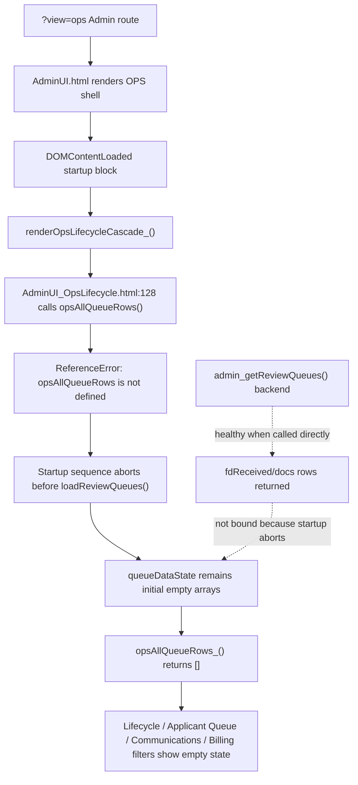
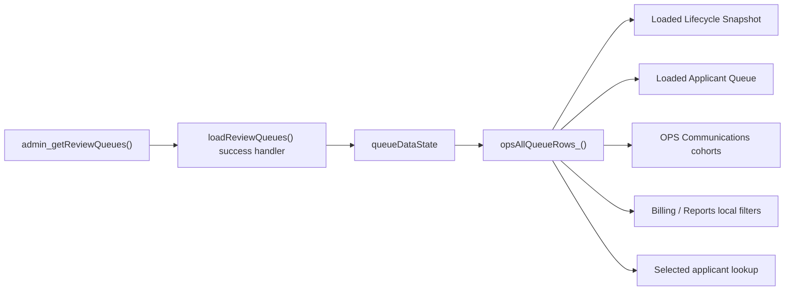

# OPS Layer Diagnostic Sprint Report v01

Date: 2026-06-06  
Classification: Read-Only Architecture / Runtime Diagnosis  
Runtime observed: r214 / 214 staging, Apps Script platform version @241  
Decision state: ACP Phase 2 HOLD; r214 production NO-GO

## Executive Decision

Recommendation: **NO-GO for ACP Phase 2**.

The OPS layer is not structurally reliable enough for the next ACP phase. The immediate queue population failure is now explained: OPS startup throws an uncaught client-side error before `loadReviewQueues()` can run.

Primary root cause:

`AdminUI_OpsLifecycle.html:128` calls `opsAllQueueRows()` instead of the defined function `opsAllQueueRows_()`.

This occurs inside `renderOpsLifecycleCascade_()`, which is invoked during `DOMContentLoaded` before `loadReviewQueues()`. The uncaught `ReferenceError` aborts the remainder of the startup sequence, leaving `queueDataState` empty. Because Lifecycle, Applicant Queue, Communications, Billing preview filters, and selected-applicant surfaces depend on `opsAllQueueRows_()`, the whole OPS layer appears empty or non-functional.

No source code was changed under this CIS.

## Evidence

Read-only Playwright probe after staging @241:

- FODE frame loaded correctly.
- `hasLoadReviewQueues`: true
- `hasOpsAllQueueRows`: true
- `hasQueueDataState`: true
- `opsAllQueueRows_().length`: 0
- `queueDataState.counts`: all zero
- `cockpitAdmissionsSummary`: `Loading`
- browser `pageerror`: `opsAllQueueRows is not defined`

Prior backend evidence remains valid:

- `admin_getReviewQueues({ force: 1 })` returns populated data.
- Review queue counts observed: `fdReceived = 119`, `docs = 14`, total queue backlog shape = `133`.
- Dashboard aggregate counts are generated separately and continue to show records.

Conclusion:

The backend queue source is not the immediate blocker. The current failure is an OPS client startup interruption.

## Data Flow Diagram

Intended current-state flow after the startup defect is removed:

## Module Dependency Map

| Area | File | Key functions / state | Role |
|---|---|---|---|
| OPS route activation | `AdminUI.html` | `INITIAL_ADMIN_VIEW`, `updateOpsVisibility_()` | Shows OPS shell and hides default Admin surface for `?view=ops`. |
| Startup orchestration | `AdminUI.html` | `DOMContentLoaded` block | Runs runtime info, dashboard metrics, campaign report, safety status, lifecycle render, communications render, stage dashboard, and review queue load. |
| Queue backend | `Admin.js` | `admin_getReviewQueues(payload)` | Builds review queue payload from sheet data and returns queue buckets. |
| Queue state | `AdminUI.html` | `queueDataState`, `loadReviewQueues(opts)` | Intended single browser-side source for loaded queue rows. |
| Loaded row accessor | `AdminUI_OpsApplicantQueue.html` | `opsAllQueueRows_()` | Concatenates queue buckets and de-dupes applicant rows. |
| Lifecycle surface | `AdminUI_OpsLifecycle.html` | `renderOpsLifecycleCascade_()`, `opsRowsForLifecycleStage_()` | Displays loaded lifecycle snapshot from `opsAllQueueRows_()`. Contains current typo defect at line 128. |
| Applicant queue | `AdminUI.html`, `AdminUI_OpsApplicantQueue.html` | `renderOpsQueue_()`, `opsQueueRowByApplicantId_()` | Displays loaded rows and manages selected-applicant context. |
| Communications | `AdminUI_OpsCommunications.html` | `opsCommunicationQueueRows_()`, `opsCommunicationSelectedRows_()` | Builds communication cohorts from `opsAllQueueRows_()` and shared row facts. |
| Shared row facts | `AdminUI_SharedRowFacts.html` | `opsBuildRowFacts_()`, `opsBuildCommunicationRowFacts_()` | Composition / classifier layer for derived row facts. |
| Aggregates / reporting | `Admin.js`, `AdminUI.html` | `admin_getOperationalDashboardMetrics()`, `admin_getCampaignApplicationReport()` | Independent aggregate paths; not equivalent to loaded OPS queue state. |

## Required Diagnostic Answers

### What initializes the OPS surface on `?view=ops`?

Server-side routing injects `INITIAL_ADMIN_VIEW`. Client-side `AdminUI.html:updateOpsVisibility_()` activates `#opsCockpitShell` and hides the default Admin wrapper when `INITIAL_ADMIN_VIEW === "ops"`.

The main runtime startup is the `DOMContentLoaded` block in `AdminUI.html`. It calls multiple renderers and RPC loaders in sequence.

### What initializes and populates `queueDataState`?

`queueDataState` is initialized in `AdminUI.html` as empty bucket arrays.

It is reset by `resetQueueDataState_()` and intended to be populated only by `loadReviewQueues(opts)`, whose success handler assigns:

- `queueDataState.fdReceived`
- `queueDataState.docs`
- `queueDataState.awaitingPayment`
- `queueDataState.payments`
- `queueDataState.anomalies`
- `queueDataState.paidApproved`
- `queueDataState.counts`
- `queueDataState.hasMore`
- `queueDataState.nextOffset`

Current failure:

`loadReviewQueues()` is not reached during startup because an earlier lifecycle render throws an uncaught `ReferenceError`.

### What does `opsAllQueueRows_()` read from?

`AdminUI_OpsApplicantQueue.html:opsAllQueueRows_()` reads only `queueDataState` buckets:

- `fdReceived`
- `docs`
- `awaitingPayment`
- `payments`
- `anomalies`
- `paidApproved`

It returns data only when those buckets have already been populated by `loadReviewQueues()`.

### Are there multiple competing state objects?

Yes. Not all are wrong, but the current structure is fragile.

| State object | Purpose | Risk |
|---|---|---|
| `queueDataState` | Loaded review queue source | Critical single dependency; empty state collapses OPS. |
| `queueRenderCache` | Rendered Review Queue paging/cache | Can diverge from `queueDataState` if render fails. |
| `queuePagerState` | Per-section pagination | Separate from actual data ownership. |
| `stageDashboardState` | Stage aggregation cards | Independent aggregate source; can show counts while queue rows are empty. |
| `campaignApplicationReportState` | Campaign/reporting totals | Full-population aggregate; not loaded queue truth. |
| `lastSearchRows` / `lastSearchResults` | Legacy Admin search / review flow | Separate legacy row source, not unified with OPS queue state. |
| `opsActionState.communicationSelectedIds` | Communication cohort selection | Depends on loaded queue IDs but is managed separately. |
| `opsApplicantDetailCache` / `currentDetail` | Selected applicant detail/modal | Can provide selected detail even when loaded queue rows are empty. |

### What calls `admin_getReviewQueues()`?

`AdminUI.html:loadReviewQueues(opts)` calls `admin_getReviewQueues({ offset, limit, force })`.

Other refresh paths call `loadReviewQueues({ force: 1 })`, including detail refresh and email correction flows.

### What consumes `queueDataState` downstream?

Downstream consumers consume it through `opsAllQueueRows_()`:

- Lifecycle loaded snapshot
- Applicant Queue rows, filters, sort, local export
- Communications action cohorts and selected rows
- Billing filter counts
- Classroom selected applicant context
- Reports/local CSV rows
- Resolver comparison diagnostics

### Are modules using the same row source / fact layer?

Partially.

The row source is mostly shared through `opsAllQueueRows_()`, but the fact layer is only partially converged:

- Communications uses `opsBuildCommunicationRowFacts_()` for Phase 1 governed facts.
- Applicant Queue, Billing, Portal, Classroom, and Reports generally use `opsBuildRowFacts_()`.
- Lifecycle still has direct classifier logic in `AdminUI_OpsLifecycle.html` and calls row facts in selected places.

This matches r205 direction only partially. r205 expects a shared row facts / classifier layer to be progressively used across OPS surfaces.

### Are modules resetting or overwriting `queueDataState` after initial load?

Source inspection found reset points:

- `resetQueueDataState_()` is called inside non-append `loadReviewQueues()`.
- Normal refresh paths can reset state before loading fresh data.

No downstream module was found directly overwriting queue buckets outside `loadReviewQueues()`. The current empty-state is explained by startup abort before population, not by a later overwrite.

### Which controls depend on selected applicant context vs loaded cohort context?

Selected-applicant context:

- Applicant Review bridge
- Portal diagnostics / portal link / reset / lock controls
- Billing preview, invoice status, draft invoice, test invoice email
- Classroom handover preview/notify controls
- Single-applicant communication preview/send/custom email
- Email correction handoff

Loaded cohort context:

- Lifecycle stage selection
- Applicant Queue search/sort/filter/local CSV
- Communication action cohorts
- Communication bulk cohort selection
- Stage batch preview/send controls
- WhatsApp fallback candidate visibility/export path

Mixed / fragile:

- Communications can show a selected cohort and selected applicant separately.
- Billing and Classroom surfaces rely on selected applicant detail but are visually adjacent to loaded queue context.
- Stage batch controls use lifecycle stage selection but can look like queue controls.

### Which legacy queues or paths are still actively used?

Actively used:

- Review Queue backend: `admin_getReviewQueues()`
- Legacy Review Queue DOM sections: `queueFdReceived`, `queueDocs`, `queueAwaitingPayment`, `queuePayments`, `queueAnomalies`, `queuePaidApproved`
- Legacy Admin Review modal/detail path: `review()`, `admin_getApplicantDetail_json`
- Legacy search result state: `lastSearchRows`, `lastSearchResults`
- Stage batch preview/send path: existing backend gates and UI controls

Not safe to treat as retired:

- Legacy Review Queue visibility
- Admin Review bridge
- Search/detail modal data source
- Stage batch preview/send gates

## Risk Register

| Risk | Severity | Evidence | Impact if ACP Phase 2 proceeds |
|---|---:|---|---|
| Startup abort from one OPS module blocks all queue loading | High | `opsAllQueueRows is not defined` page error before `loadReviewQueues()` | Any module typo can collapse the whole OPS surface. |
| Single loaded-row source has no health gate | High | `queueDataState` stayed empty while backend data existed | Operators see no applicants and controls appear broken. |
| Aggregates and loaded queues are visually co-present but semantically different | High | Dashboard/campaign counts loaded while queue rows empty | Operators misread aggregate reality as queue reality or vice versa. |
| Shared row facts adoption is partial | Medium | Communications governed; lifecycle/applicant queue still mixed | ACP Phase 2 may converge onto unstable or duplicate classifiers. |
| Selected applicant state is split across queue row, detail cache, modal state, and communication selection | High | Multiple independent state objects | Wrong/blank applicant context risk for preview and handoff actions. |
| Failure handlers do not expose queue-load failure prominently | Medium | UI stayed at `Loading`; backend/console error not surfaced to operator | Failures look like empty reality instead of failed initialization. |
| Playwright smoke/label checks can pass while core data binding fails | High | Smoke + labels PASS; queue-health FAIL | Acceptance gates can provide false confidence. |

## Top Fragility Points

1. `renderOpsLifecycleCascade_()` can abort the entire OPS startup sequence before queue loading. Current concrete defect: `opsAllQueueRows()` typo in `AdminUI_OpsLifecycle.html:128`.
2. `DOMContentLoaded` startup is sequential and not isolated; one renderer failure prevents later data loaders from executing.
3. `queueDataState` is the single loaded-row dependency, but the UI has no explicit “queue load failed” state or retry health indicator.
4. Aggregate surfaces and loaded queue surfaces use separate backend paths but are displayed in one cockpit without a hard data-source boundary.
5. Selected-applicant state is distributed across loaded queue rows, detail cache, communication selected IDs, modal detail, and action state.
6. Legacy Review Queues, OPS Applicant Queue, Lifecycle, and Communications are visually unified but still use mixed legacy and row-facts logic.
7. Current Playwright smoke and label tests verify route/labels, not core state-machine integrity; queue-health is necessary as a release gate.

## Recommended Playwright Tests

Keep existing:

- `test:smoke`
- `test:ops-labels`
- `test:ops-usability`
- `test:ops-queue-health`

Add or extend:

1. `ops-startup-errors.spec.ts`: fail if browser `pageerror` or console error occurs during `?view=ops` startup.
2. `ops-queue-rpc-binding.spec.ts`: compare direct `admin_getReviewQueues({ force: 1 })` counts with browser `queueDataState` lengths.
3. `ops-loaded-row-consumers.spec.ts`: assert Lifecycle, Applicant Queue, and Communications all show at least one loaded row when backend queue count is non-zero.
4. `ops-selected-applicant-context.spec.ts`: click one visible loaded row and assert ApplicantID propagates to Communications, Billing, Portal, and Classroom read-only context panels.
5. `ops-aggregate-vs-loaded-copy.spec.ts`: assert page contains explicit “aggregate/full-population” vs “loaded snapshot” labels when both report and queue sections are visible.
6. `ops-no-mutation-controls.spec.ts`: assert send/export/supervisory buttons are not clicked and are disabled or gated in non-authorized/read-only acceptance.
7. `ops-frame-target-health.spec.ts`: assert Playwright targets `userHtmlFrame` with `google.script.run`, `loadReviewQueues`, and `opsAllQueueRows_` present before evaluating app state.

## GO / NO-GO Recommendation

ACP Phase 2: **NO-GO**.

Rationale:

- OPS startup is currently breakable by a single uncaught module-level error.
- The loaded-row dependency chain is not yet protected by startup isolation or data-binding health checks.
- Existing acceptance checks can pass while the queue layer is non-functional.
- r205 explicitly identified selected-record binding failures, queue semantic overlap, duplicate helper logic, and browser/cache confusion as high-risk areas. The current evidence confirms those risks are still active.

Minimum condition before reconsidering ACP Phase 2:

- Fix the `opsAllQueueRows()` typo.
- Isolate OPS startup renderers so one module failure cannot prevent `loadReviewQueues()`.
- Add queue-health and startup-error Playwright checks as mandatory acceptance gates.
- Verify populated `queueDataState`, visible applicant rows, Lifecycle counts, and Communications cohorts in staging.

## Stop Condition

This sprint ends at diagnosis.

Files edited under this CIS:

- `OPS_LAYER_DIAGNOSTIC_SPRINT_REPORT_v01.md` only.

No runtime source code was changed.

No deployment was performed.

No Apps Script version was created.

No deployment repin was performed.

No commit was made.

No sheet or runtime configuration was modified.
