# r221A Stage Batch Authority Audit v01

Status: Audit only  
Track: H  
Target surface: Legacy Admin `?view=admin`  
Baseline:
- Admin staging accepted baseline: `@256` (`r220A` AdminUI-only label/grouping cleanup)
- Previous Admin rollback baseline: `@255` (`r219`)
- Student staging unchanged: `@247`

## Scope Confirmation

This audit inspected Stage Batch authority only.

Read-only files inspected:
- [AdminUI.html](E:/Gdrive/01_SANJAY/Codex_Sync/FODE_Runtime_1wog/AdminUI.html)
- [Admin.js](E:/Gdrive/01_SANJAY/Codex_Sync/FODE_Runtime_1wog/Admin.js)
- `Config.js` context not required for authority conclusions

No runtime files were changed during audit.  
No send was performed.  
No deployment was performed.  
No rollback was performed.

## Current Git Status

At audit start:
- `git status -sb` → `## main...origin/main`

At audit end:
- only this audit report is new/changed

## Executive Verdict

Verdict: `PASS WITH FOLLOW-UP`

The accepted legacy Admin Stage Batch authority model is materially sound:
- send is not row-selection driven
- send is not based on visible Review Queue rows
- send uses a fresh preview snapshot cached per admin
- send re-validates stage/message/limit/offset/request parity before execution
- send uses cached `candidateIds` from preview, not a newly rescanned cohort

Primary follow-up risks:
1. `candidateHash` is generated and checked if present, but the real authority is `candidateIds` parity; hash is secondary.
2. preview freshness relies on cache presence and field parity, not a dedicated age-expiry check beyond cache TTL.
3. Script Properties are not the primary send authority, but Stage Batch still uses Script Properties for stage cursors and wider system telemetry, so property hygiene remains operationally relevant.

No unsafe bypass of preview authority was found in the audited Stage Batch path.

## Authority Chain Diagram

```mermaid
flowchart LR
  A["Operator selects stage"] --> B["batchState.selectedStage / messageType"]
  B --> C["previewStageBatchUi_()"]
  C --> D["admin_previewStageBatch(payload)"]
  D --> E["collectStageBatchCohort_()"]
  E --> F["candidateIds + candidateHash + requestId + batchId"]
  F --> G["writeStageBatchPreviewCache_(adminEmail, snapshot)"]
  G --> H["client stores previewRequestId + previewReady state"]
  H --> I["sendStageBatchUi_() confirm"]
  I --> J["admin_sendStageBatch(payload)"]
  J --> K["readStageBatchPreviewCache_(adminEmail)"]
  K --> L["parity checks: stage/message/limit/offset/requestId/candidate set"]
  L --> M["sendApplicantMessage_() for cached candidateIds only"]
  M --> N["row/log writeback inside sendApplicantMessage_()"]
  M --> O["clearStageBatchPreviewCache_(adminEmail)"]
```



## Client State Map

Client Stage Batch state is held in `batchState` at [AdminUI.html:2276](E:/Gdrive/01_SANJAY/Codex_Sync/FODE_Runtime_1wog/AdminUI.html:2276).

Relevant fields:
- `selectedStage`
- `priority`
- `messageType`
- `sendable`
- `previewReady`
- `previewStage`
- `previewLimit`
- `previewOffset`
- `previewEligible`
- `previewRequestSeq`
- `previewActiveSeq`
- `previewClientRequestId`
- `previewClientElapsedMs`
- `previewRequestId`
- `disabledReason`
- `busy`
- `action`
- `result`

Preview reset logic:
- `resetBatchPreviewState_()` at [AdminUI.html:5941](E:/Gdrive/01_SANJAY/Codex_Sync/FODE_Runtime_1wog/AdminUI.html:5941)

Fresh preview requirement in UI:
- `previewReady === true`
- `selectedStage === previewStage`
- `previewLimit === current limit`
- `previewOffset === current offset`
- `previewRequestId` present
- `sendable === true`

See:
- [AdminUI.html:6139](E:/Gdrive/01_SANJAY/Codex_Sync/FODE_Runtime_1wog/AdminUI.html:6139)
- [AdminUI.html:6359](E:/Gdrive/01_SANJAY/Codex_Sync/FODE_Runtime_1wog/AdminUI.html:6359)

## Client/UI Contract

### `previewStageBatchUi_()`

Defined at:
- [AdminUI.html:6218](E:/Gdrive/01_SANJAY/Codex_Sync/FODE_Runtime_1wog/AdminUI.html:6218)

Request payload sent to backend:
- `stage`
- `limit`
- `offset`

RPC:
- `.admin_previewStageBatch({ stage, limit, offset })` at [AdminUI.html:6352](E:/Gdrive/01_SANJAY/Codex_Sync/FODE_Runtime_1wog/AdminUI.html:6352)

On successful preview with `response.ok === true` and `response.count > 0`, client stores:
- `previewReady = true`
- `previewStage`
- `previewLimit`
- `previewOffset`
- `previewEligible`
- `previewRequestId = response.requestId`

See:
- [AdminUI.html:6303](E:/Gdrive/01_SANJAY/Codex_Sync/FODE_Runtime_1wog/AdminUI.html:6303)

### `sendStageBatchUi_()`

Defined at:
- [AdminUI.html:6354](E:/Gdrive/01_SANJAY/Codex_Sync/FODE_Runtime_1wog/AdminUI.html:6354)

Client-side enablement guard:
- valid fresh preview
- not busy
- `stageBatchExecutionAllowed_() === true`

RPC payload sent to backend:
- `stage`
- `limit`
- `offset`
- `previewRequestId`
- `confirmSend: true`

RPC call:
- [AdminUI.html:6489](E:/Gdrive/01_SANJAY/Codex_Sync/FODE_Runtime_1wog/AdminUI.html:6489)

Important:
- client does **not** send `candidateIds`
- client does **not** send `candidateHash`
- client does **not** send `batchId`

Those remain backend-side preview authority artifacts.

### Confirmation wording

Client confirmation explicitly shows:
- stage
- message type
- preview request
- exact preview count
- send cap

See:
- [AdminUI.html:6387](E:/Gdrive/01_SANJAY/Codex_Sync/FODE_Runtime_1wog/AdminUI.html:6387)

## Backend Payload Contract

### `admin_previewStageBatch(payload)`

Defined at:
- [Admin.js:6387](E:/Gdrive/01_SANJAY/Codex_Sync/FODE_Runtime_1wog/Admin.js:6387)

Required/used request fields:
- `stage`
- `limit`
- `offset`

Authority gates before preview:
- caller must be admin
- `requireOperationsAdmin_(adminEmail)` at [Admin.js:6405](E:/Gdrive/01_SANJAY/Codex_Sync/FODE_Runtime_1wog/Admin.js:6405)
- property regression guard at [Admin.js:6407](E:/Gdrive/01_SANJAY/Codex_Sync/FODE_Runtime_1wog/Admin.js:6407)
- preview mode enabled at [Admin.js:6438](E:/Gdrive/01_SANJAY/Codex_Sync/FODE_Runtime_1wog/Admin.js:6438)

Preview response fields returned by `stageBatchPreviewResponse_()`:
- `ok`
- `action`
- `result`
- `message`
- `emptyReason`
- `elapsedMs`
- `requestId`
- `debugId`
- `stage`
- `messageType`
- `batchId`
- `count`
- `clientElapsedMs`
- `previewLimit`
- `limit`
- `requestedOffset`
- `offset`
- `offsetApplied`
- `offsetIgnored`
- `offsetMode`
- `sendable`
- `sendDisabledReason`
- `writtenAt`
- `candidateIds`
- `candidateCount`
- `candidateHash`
- `firstScannedRow`
- `scanStartRow`
- `scanEndRow`
- `rowsScanned`
- `scanCap`
- `windowsScanned`
- `fallbackContinuationUsed`
- `requestedLimit`
- `partial`
- `partialReason`
- `totalInStage`
- `eligibleUnsentFound`
- `eligible`
- `blocked`
- `blockedCount`
- `alreadyProcessedCount`
- `idempotencySummary`
- `propertyGuard`
- `alreadySentExcluded`
- `failedExcluded`
- `blockedByReason`
- `eligibleApplicantIdsSample`
- `blockedApplicantIdsSample`
- `warning`
- `warnings`
- `processedCount`
- `remainingEligibleEstimate`
- `priority`
- `blockCode`
- `blockReason`
- `error`
- `phaseTimings`

Source:
- [Admin.js:5996](E:/Gdrive/01_SANJAY/Codex_Sync/FODE_Runtime_1wog/Admin.js:5996)

### Preview cache contents

Preview writes per-admin cache via:
- `CacheService.getUserCache()` at [Admin.js:5817](E:/Gdrive/01_SANJAY/Codex_Sync/FODE_Runtime_1wog/Admin.js:5817)
- TTL `600` seconds at [Admin.js:5828](E:/Gdrive/01_SANJAY/Codex_Sync/FODE_Runtime_1wog/Admin.js:5828)

Cached fields written:
- `stage`
- `limit`
- `offset`
- `messageType`
- `eligible`
- `eligibleUnsentFound`
- `debugId`
- `requestId`
- `writtenAt`
- `candidateIds`
- `candidateCount`
- `candidateHash`
- `batchId`
- `idempotencySummary`

Source:
- [Admin.js:6584](E:/Gdrive/01_SANJAY/Codex_Sync/FODE_Runtime_1wog/Admin.js:6584)

### `admin_sendStageBatch(payload)`

Defined at:
- [Admin.js:6662](E:/Gdrive/01_SANJAY/Codex_Sync/FODE_Runtime_1wog/Admin.js:6662)

Required/used request fields:
- `stage`
- `limit`
- `offset`
- `previewRequestId`
- `confirmSend`

Backend gates before send:
- caller must be admin
- `requireOperationsAdmin_(adminEmail)` at [Admin.js:6670](E:/Gdrive/01_SANJAY/Codex_Sync/FODE_Runtime_1wog/Admin.js:6670)
- batch sends enabled at [Admin.js:6672](E:/Gdrive/01_SANJAY/Codex_Sync/FODE_Runtime_1wog/Admin.js:6672)
- `confirmSend === true` at [Admin.js:6695](E:/Gdrive/01_SANJAY/Codex_Sync/FODE_Runtime_1wog/Admin.js:6695)
- valid supported stage at [Admin.js:6702](E:/Gdrive/01_SANJAY/Codex_Sync/FODE_Runtime_1wog/Admin.js:6702)
- valid supported message type at [Admin.js:6709](E:/Gdrive/01_SANJAY/Codex_Sync/FODE_Runtime_1wog/Admin.js:6709)
- matching preview snapshot via `readStageBatchPreviewCache_(adminEmail)` at [Admin.js:6717](E:/Gdrive/01_SANJAY/Codex_Sync/FODE_Runtime_1wog/Admin.js:6717)

## Validation Matrix

| Gate | Layer | Enforced | Notes |
|---|---|---|---|
| Admin access | backend | YES | `isAdmin_` |
| Operations Admin / Super Admin | UI + backend | YES | UI `CAN_RUN_OPERATIONS_ACTIONS`; backend `requireOperationsAdmin_` |
| Stage selected | UI + backend | YES | empty stage blocked both sides |
| Supported message type | UI + backend | YES | derived from selected stage |
| Preview required before send | UI + backend | YES | UI `previewReady`; backend preview parity |
| Explicit confirmation | UI + backend | YES | browser confirm + `confirmSend === true` |
| Preview request ID present | UI + backend | YES | UI requires; backend rejects missing |
| Stage parity | backend | YES | cached stage must match requested stage |
| Message type parity | backend | YES | cached message type must match recalculated message type |
| Limit parity | backend | YES | cached limit must match requested limit |
| Offset parity | backend | YES | cached offset must match requested offset |
| Candidate IDs present | backend | YES | rejects missing/empty |
| Candidate hash parity | backend | CONDITIONAL | enforced only if cached hash present |
| Send cohort comes from preview | backend | YES | sends cached `candidateIds` only |
| Freshness by cache existence | backend | YES | missing cache blocks send |
| Freshness by age timestamp | backend | NO explicit age check | relies on user cache TTL and parity |
| Per-record revalidation | backend/send path | YES | `sendApplicantMessage_()` can still block per candidate |
| Cache cleared after send | backend | YES | `clearStageBatchPreviewCache_()` |

## Audit Questions Answered

1. **What exact data is returned by `admin_previewStageBatch(payload)`?**  
   The full preview RPC contract is normalized by `stageBatchPreviewResponse_()` and includes stage/message/preview identity, `requestId`, `batchId`, `candidateIds`, `candidateHash`, counts, blocked reasons, idempotency summary, property guard, and scan diagnostics. See [Admin.js:5996](E:/Gdrive/01_SANJAY/Codex_Sync/FODE_Runtime_1wog/Admin.js:5996).

2. **What exact fields are stored client-side after preview?**  
   `previewReady`, `previewStage`, `previewLimit`, `previewOffset`, `previewEligible`, `previewRequestId`, plus `result`. See [AdminUI.html:6303](E:/Gdrive/01_SANJAY/Codex_Sync/FODE_Runtime_1wog/AdminUI.html:6303).

3. **What exact fields are sent by `sendStageBatchUi_()`?**  
   `stage`, `limit`, `offset`, `previewRequestId`, `confirmSend: true`. See [AdminUI.html:6489](E:/Gdrive/01_SANJAY/Codex_Sync/FODE_Runtime_1wog/AdminUI.html:6489).

4. **What exact fields does `admin_sendStageBatch(payload)` require?**  
   Effectively: valid `stage`, normalized `limit`, normalized `offset`, non-empty `previewRequestId`, and `confirmSend === true`. See [Admin.js:6690](E:/Gdrive/01_SANJAY/Codex_Sync/FODE_Runtime_1wog/Admin.js:6690).

5. **Does the backend validate that the send request matches the latest preview authority?**  
   Yes. It validates cached snapshot existence, stage, message type, limit, offset, request ID, eligible count, candidate IDs presence, and candidate hash consistency where present. See [Admin.js:6770](E:/Gdrive/01_SANJAY/Codex_Sync/FODE_Runtime_1wog/Admin.js:6770).

6. **Is previewRequestId required, optional, or informational?**  
   Required for send. Missing request ID produces `PREVIEW_REQUEST_ID_MISSING` under `PREVIEW_STALE`. See [Admin.js:6772](E:/Gdrive/01_SANJAY/Codex_Sync/FODE_Runtime_1wog/Admin.js:6772).

7. **Is candidateHash required and enforced server-side?**  
   It is generated and checked if present. Enforcement is conditional: `hashMatch = !candidateHashPresent || previewCandidateHash === computedCandidateHash`. So presence matters; absence does not itself block. See [Admin.js:6747](E:/Gdrive/01_SANJAY/Codex_Sync/FODE_Runtime_1wog/Admin.js:6747).

8. **Is batchId required and enforced server-side?**  
   No. `batchId` is generated for preview/result identity and diagnostics but is not required in the send request.

9. **Are candidateIds validated server-side against preview authority?**  
   Yes. Backend reads cached `candidateIds`, requires them to exist and be non-empty, checks count consistency, and sends that exact list. See [Admin.js:6802](E:/Gdrive/01_SANJAY/Codex_Sync/FODE_Runtime_1wog/Admin.js:6802) and [Admin.js:6903](E:/Gdrive/01_SANJAY/Codex_Sync/FODE_Runtime_1wog/Admin.js:6903).

10. **Can the client accidentally send a stale preview?**  
   Low risk. UI and backend both block stale preview conditions. However, “fresh” is parity-based and cache-based, not explicitly age-stamped beyond user-cache TTL.

11. **Can the client accidentally send a different stage/message type than was previewed?**  
   No, not without backend rejection. Stage/message/limit/offset/request ID parity is enforced server-side.

12. **Can Send Stage Batch become enabled without a valid fresh preview?**  
   UI-side: no. `sendBtn.disabled = !previewReady || busy || !stageBatchAllowed`. See [AdminUI.html:6174](E:/Gdrive/01_SANJAY/Codex_Sync/FODE_Runtime_1wog/AdminUI.html:6174).

13. **What counts as a “fresh” preview?**  
   Matching selected stage, matching limit, matching offset, matching request ID, positive eligible count, cache snapshot exists, and candidate snapshot structurally valid.

14. **What happens if a candidate was already sent after preview but before send?**  
   Send still iterates the previewed `candidateIds`, but per-record send goes through `sendApplicantMessage_()`, which can return `BLOCKED` or other non-sent results. So preview authority does not bypass downstream idempotency/cooldown/writeback checks.

15. **What happens if cooldown/cap/idempotency changes between preview and send?**  
   Backend send still enforces those rules through `sendApplicantMessage_()` and broader send gates. The cohort remains the previewed set, but individual records can block/skip at send time.

16. **Does send use only the previewed candidate set or can it rescan a different cohort?**  
   It uses only the previewed cached `candidateIds`. No fresh cohort scan occurs inside `admin_sendStageBatch()`.

17. **Are per-record results written back correctly?**  
   Per-record outcomes are captured via `sendApplicantMessage_()` result handling into `sent`, `blocked`, `failed`, and `blockedByReason`. Actual row/log writeback occurs in `sendApplicantMessage_()`, which is outside this audit’s mutation scope but remains the active path.

18. **Are failed/skipped/sent records distinguishable?**  
   Yes:
   - sent → `sent`
   - blocked → `blocked` + `blockedByReason`
   - failed → `failed`
   Preview also distinguishes `alreadySentExcluded`, `failedExcluded`, and `alreadyProcessedCount`.

19. **Does Script Properties count grow during preview or send?**  
   Preview/send authority itself is not stored in Script Properties. Preview uses user cache. However:
   - stage cursors use Script Properties for non-deterministic cursor advancement at [Admin.js:6125](E:/Gdrive/01_SANJAY/Codex_Sync/FODE_Runtime_1wog/Admin.js:6125)
   - property regression guard is explicitly checked before preview
   - broader send system telemetry/idempotency outside this exact contract may still use properties

20. **Are any send-state values incorrectly stored in Script Properties?**  
   Not in the core Stage Batch preview/send authority contract. The preview snapshot is in user cache, not properties. Script Properties remain auxiliary/system-level, not the primary authority for this path.

21. **Does current behaviour still preserve the r219/r220A accepted operational path?**  
   Yes. The accepted “next eligible unsent cohort” model is preserved and no checkbox/row-selection authority is involved.

22. **What minimal hardening, if any, is needed?**  
   See recommendations below. No structural redesign is indicated.

## Stale Preview Risk Assessment

Risk: `LOW-MEDIUM`

Strengths:
- UI requires fresh preview state
- backend independently rejects stale or mismatched preview
- preview cache is per-admin
- cache is cleared after send

Residual weaknesses:
- no explicit age validation against `writtenAt` inside send
- preview freshness depends on cache TTL and parity, not “preview must be newer than X”
- conditional candidate-hash enforcement means `candidateIds` remain the real authority, hash is supporting evidence

Operational conclusion:
- acceptable under current model
- could be hardened later with explicit preview age rejection if needed

## Send Mismatch Risk Assessment

Risk: `LOW`

Reason:
- send does not rescan a different cohort
- send uses cached `candidateIds` from preview
- stage/message/limit/offset/request ID mismatch is rejected
- invalid preview snapshot is rejected

This is the most important safe property in the current design, and it is present.

## Script Properties Risk Assessment

Risk: `LOW-MEDIUM`

Findings:
- primary Stage Batch preview authority is **not** in Script Properties
- preview snapshot uses `CacheService.getUserCache`
- Script Properties are still involved in:
  - stage cursor persistence
  - wider system property health
  - possibly wider send/idempotency telemetry outside the exact preview cache

Important distinction:
- Script Properties are **not** the authoritative preview snapshot for Stage Batch send
- Script Properties still matter operationally because property regression can block preview

## Rollback Baseline Health Check

Read-only deployment checks performed during audit:
- `clasp deployments`
- `clasp versions`

### Current deployment truth

`clasp deployments` reported:
- HEAD deployment: `AKfycbwM8iTBSoEFhz3x-KOVUHsaN8DhJctbM2ksdyHeVmQ @HEAD`
- Student staging deployment: `AKfycbxqTpEAJzk2NwFOumKTV0-bphasgPxM-kJHpbx5KobveYrhNtP5FbP0LJvL8kpA4PBv @247`
- Admin staging deployment: `AKfycbxkuj6ElPa8xE9WJnECcW9u_hGNPMpd79F5Vhxgur-p7MCpmDF2HaLFIgx7yTYRC8aZ @256`

Confirmed deployment IDs:
- Admin staging: `AKfycbxkuj6ElPa8xE9WJnECcW9u_hGNPMpd79F5Vhxgur-p7MCpmDF2HaLFIgx7yTYRC8aZ`
- Student staging: `AKfycbxqTpEAJzk2NwFOumKTV0-bphasgPxM-kJHpbx5KobveYrhNtP5FbP0LJvL8kpA4PBv`

### Version availability

`clasp versions` confirmed protected versions still exist:
- `247 - r217: resolver parity document-state classification`
- `250 - r218J: legacy admin operator surface simplification`
- `252 - r218N: add read-only stage batch eligibility trace helper`
- `253 - r218N: expose clean trace helper to deployed Admin staging runtime`
- `254 - r218O: clarify stage batch and review queue wording`
- `255 - r219: simplify legacy and OPS stage batch guardrails`
- `256 - r220A legacy admin dashboard label grouping cleanup`

### Trustworthiness assessment

| Baseline | Status | Trustworthy | Notes |
|---|---|---|---|
| Admin current `@256` | exists and deployed | YES | current accepted Admin staging pin |
| Admin rollback `@255` | exists and not deleted | YES | accepted prior Admin baseline |
| Student `@247` | exists and deployed | YES | separate Student staging pin, unchanged |

### Rollback command validity

Rollback to `@255`:

```powershell
clasp deploy --deploymentId AKfycbxkuj6ElPa8xE9WJnECcW9u_hGNPMpd79F5Vhxgur-p7MCpmDF2HaLFIgx7yTYRC8aZ --versionNumber 255 --description "rollback: r219 accepted legacy admin dashboard baseline"
```

Return to `@256`:

```powershell
clasp deploy --deploymentId AKfycbxkuj6ElPa8xE9WJnECcW9u_hGNPMpd79F5Vhxgur-p7MCpmDF2HaLFIgx7yTYRC8aZ --versionNumber 256 --description "staging: r220A legacy admin dashboard label grouping cleanup"
```

Assessment:
- syntax is valid
- target deployment is Admin staging only
- Student staging is unaffected
- production is unaffected
- no source edits are required
- rollback/return can each be completed with one `clasp deploy --deploymentId ... --versionNumber ...` command

Ambiguity/risk:
- final operational trust still depends on post-rollback browser verification, especially Stage Batch and legacy Admin load behavior
- HEAD deployment exists separately but is not targeted by the rollback command

Explicit confirmation:
- No rollback was performed during audit
- No deployment was performed during audit

## Protected Function List

Audited protected functions/areas:
- `previewStageBatchUi_()`
- `sendStageBatchUi_()`
- `renderStageBatchSummary_()`
- `stageBatchPreviewResponse_()`
- `stageBatchPreviewFinalizeForRpc_()`
- `admin_previewStageBatch(payload)`
- `admin_sendStageBatch(payload)`
- idempotency/cooldown/cap logic
- `Last_Contact_*` writeback logic via downstream send path

## Recommended Minimal Patch, If Approved Later

No patch is required to preserve current operational safety.

If hardening is later approved, keep it minimal:
1. add explicit backend preview age validation using cached `writtenAt`
2. make `candidateHash` mandatory when cached preview exists, instead of conditional
3. improve send-block diagnostics so stale-parity rejection is more operator-readable without exposing unnecessary internals

Do **not** change:
- preview → send authority model
- cached cohort send contract
- cooldown/idempotency semantics
- row-selection model

## Final Assessment

The current accepted Stage Batch operational path remains trustworthy:
- preview is authoritative
- send is parity-gated
- send uses previewed cached `candidateIds`
- Student staging is isolated
- rollback baselines `@255` and `@256` are healthy and usable

No runtime edits were made.  
No deployment was made.  
No send was made.

