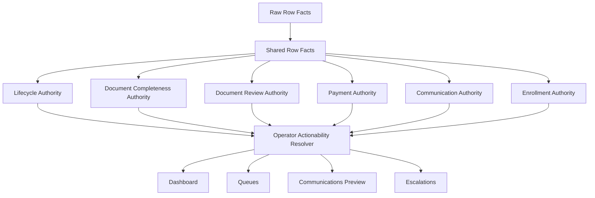
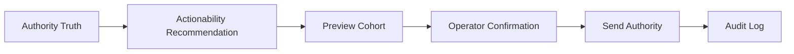
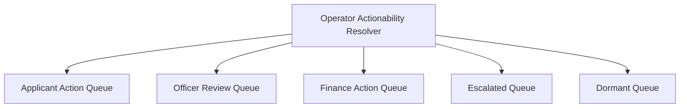

# r23A Architecture Documentation Consolidation and Operator Actionability Proposal

Status: proposal / documentation-governance only
Track: documentation only / no runtime release
Scope: architecture documentation inventory, consolidation recommendation, and Operator Actionability Resolver proposal

No runtime code, Apps Script source, deployment, Sheet, queue, communication behavior, version, repin, commit, tag, or file deletion was performed.

## Executive Summary

FODE's current documentation is directionally sound but fragmented across roadmap files, operations documents, architecture maps, audits, and release-specific authority reports.

The strongest current architecture line is:

Raw row facts -> shared row facts -> domain authorities -> operator surfaces

The missing documented layer is:

Domain authorities -> Operator Actionability Resolver -> operator surfaces

Recommendation:

1. Keep the existing LAP principle: truth authorities determine what is true.
2. Add a documented, derived, read-only Operator Actionability Resolver: it determines what should happen next.
3. Consolidate architecture documentation under `docs/architecture/`, but do not move files until a separate migration CIS approves it.
4. Treat audits as evidence inputs, not canonical architecture.
5. Mark older Mermaid and authority docs as source material to merge, not immediate deletion candidates.

## A. Architecture Documentation Inventory

### 1. Current Authoritative Architecture Documents

| Document | Current Role | Recommendation |
|---|---|---|
| `ARCHITECTURE_ROADMAP_NO_CRM.md` | Strategic no-CRM admissions and operations roadmap. Defines target system roles, ownership boundaries, module boundaries, and refactor roadmap. | KEEP as strategic source. Merge core architecture sections into future `docs/architecture/Architecture_Overview.md` and `Roadmap.md`. |
| `docs/operations/ROADMAP_UNIFIED_OPERATIONS_PLATFORM.md` | Future unified operations platform roadmap. References shared canonical layers and product overlays. | KEEP. Merge into future `docs/architecture/Roadmap.md`. |
| `docs/operations/S5A_OPERATIONAL_AUTHORITY_MAP.md` | Best current canonical authority model for shared primitives. | KEEP as canonical until migrated. Merge into future `docs/architecture/Authority_Model.md`. |
| `docs/operations/S5A_CANONICAL_INTAKE_LIFECYCLE.md` | Canonical intake lifecycle and operational interpretation. | KEEP as canonical lifecycle source. Merge or cross-reference from future `docs/architecture/Operational_Model.md`. |
| `docs/operations/S5B_LIFECYCLE_SEMANTICS_REVIEW.md` | Lifecycle semantics refinement and caution against collapsing states. | KEEP as semantic reference. Merge relevant distinctions into future `Operational_Model.md`. |
| `docs/FODE_ARCHITECTURE_MAP_r205.md` | Working architecture/refactor benchmark with Mermaid diagrams. | KEEP as diagram/source benchmark. Mark as superseded once consolidated diagrams exist. |

### 2. Current Authority Model Documents

| Document | Authority Coverage | Recommendation |
|---|---|---|
| `docs/operations/S5A_OPERATIONAL_AUTHORITY_MAP.md` | Intake, document, payment, finance, portal, communication ownership. | Canonical authority model today. |
| `docs/operations/S5A_CANONICAL_INTAKE_LIFECYCLE.md` | Canonical intake lifecycle states. | Canonical lifecycle model today. |
| `docs/operations/S5B_LIFECYCLE_SEMANTICS_REVIEW.md` | Lifecycle semantic distinctions. | Keep as supporting semantic reference. |
| `FODE_AUTHORITY_MODEL_r105.md` | Historical authority invariant checklist. | Archive/retain as historical reference after migration. |
| `audits/r22xA_intake_completeness_authority_audit_v01.md` | Completeness vs review authority discovery. | Use as evidence; merge conclusions into authority model. |
| `audits/r225A_document_payment_queue_count_authority_audit_v01.md` | Document/payment queue count authority. | Use as evidence; merge queue distinctions into operational model. |
| `audits/r221A_stage_batch_authority_audit_v01.md` | Preview/send authority model. | Use as evidence; merge communication/send authority into communication model. |
| `audits/r226A_ops_dependency_and_strategic_decision_v01.md` | OPS dependency and freeze direction. | Use as evidence; merge OPS freeze boundary into architecture overview. |
| `audits/r226B_ops_freeze_boundary_note_v01.md` | OPS freeze boundary note. | Use as governance evidence; merge into roadmap/guardrails. |

### 3. Current Mermaid Source Locations

| Source | Diagrams | Recommendation |
|---|---|---|
| `docs/FODE_ARCHITECTURE_MAP_r205.md` | Applicant lifecycle state machine; OPS communications sequence; document upload to review sequence. | Current primary Mermaid source. Merge into future `docs/architecture/Mermaid/`. |
| `audits/r221A_stage_batch_authority_audit_v01.md` | Stage Batch preview/send authority flow. | Promote concept into future communication model diagram. |
| `OPS_LAYER_DIAGNOSTIC_SPRINT_REPORT_v01.md` | OPS diagnostic flowcharts. | Keep as diagnostic evidence only unless still current. |

There is no single authoritative Mermaid folder today.

### 4. Current Operational Model Documentation

| Document | Coverage | Recommendation |
|---|---|---|
| `docs/operations/S5A_CANONICAL_INTAKE_LIFECYCLE.md` | Intake lifecycle and operational interpretation. | Merge into future operational model. |
| `docs/operations/S5A_OPERATIONAL_AUTHORITY_MAP.md` | Authority ownership and compatibility boundaries. | Merge into future authority model. |
| `docs/operations/S5B_LIFECYCLE_SEMANTICS_REVIEW.md` | Shared states vs product overlays. | Merge key distinctions into operational model. |
| `audits/r225A_document_payment_queue_count_authority_audit_v01.md` | Review queue vs lifecycle/actionability distinction. | Merge into queue model. |
| `audits/r223A_dashboard_calculation_authority_design_v01.md` | Dashboard calculation authority design. | Merge dashboard/operator-surface guidance. |
| `audits/r222A_dashboard_metric_authority_audit_v01.md` | Dashboard authority mapping. | Merge relevant dashboard authority boundaries. |

### 5. Current Communication Model Documentation

| Document | Coverage | Recommendation |
|---|---|---|
| `docs/operations/S5A_COMMUNICATION_WORKFLOW.md` | Communication workflow reference. | Merge into future `Communication_Model.md`. |
| `docs/operations/S5C_WHATSAPP_ADMIN_WORKFLOW.md` | WhatsApp admin workflow. | Keep as channel-specific workflow; cross-reference from communication model. |
| `audits/r221A_stage_batch_authority_audit_v01.md` | Stage Batch preview/send authority. | Merge preview/send authority into communication model. |
| `docs/stabilization/EMAIL_WORKFLOW_CODE_AUDIT.md` | Email sender code audit. | Keep as stabilization evidence, not canonical model. |
| `audits/FODE_r214_Data_Flow_Audit.md` | Queue/cooldown data flow and communication readiness. | Use as evidence for communication cooldown and queue model. |

### 6. Duplicate, Obsolete, Superseded, or Fragmented Documents

| Document | Issue | Recommendation |
|---|---|---|
| `FODE_AUTHORITY_MODEL_r105.md` | Historical model predates current LAP refinements. | ARCHIVE after core invariants are merged. |
| `docs/FODE_ARCHITECTURE_MAP_r205.md` | Valuable but version-specific architecture benchmark. | MERGE diagrams, then mark superseded by consolidated architecture docs. |
| `audits/r220_*`, `r222A_*`, `r223A_*`, `r225A_*` | Release-specific authority audits. | KEEP as audit evidence; do not treat as canonical docs. |
| `audits/r226A_*`, `r226B_*` | OPS strategic decision and freeze evidence. | MERGE freeze boundary into architecture roadmap; keep audit files. |
| `OPS_LAYER_DIAGNOSTIC_SPRINT_REPORT_v01.md` | Diagnostic report outside `docs/`/`audits` hierarchy. | MOVE/ARCHIVE later if approved; do not delete now. |
| `docs/operations/S5A_*` group | Multiple related docs under operations but no single entrypoint. | MERGE into future consolidated `docs/architecture/` structure while preserving originals until reviewed. |

## B. Recommended Consolidated Architecture Structure

Do not implement this folder move until separately approved.

Recommended target:

```text
docs/architecture/
  README.md
  Architecture_Overview.md
  Authority_Model.md
  Operational_Model.md
  Operator_Actionability_Resolver.md
  Queue_Model.md
  Communication_Model.md
  Roadmap.md
  Governance.md
  Mermaid/
    Architecture_Flow.mmd
    Authority_Model.mmd
    Operator_Actionability_Flow.mmd
    Queue_Model.mmd
    Communication_Model.mmd
    Lifecycle_State_Machine.mmd
```

Recommended entrypoint:

`docs/architecture/README.md`

It should explain where to find:

- architecture overview
- authority model
- operational model
- communication model
- queue model
- Mermaid sources
- roadmap
- governance/retired document list

## C. Updated Architecture Proposal

Approved architecture direction:

```text
Raw Row Facts
-> Shared Row Facts
-> Authority Layer
-> Operator Actionability Resolver
-> Dashboard / Queues / Communications / Escalations
```

The Operator Actionability Resolver is derived and read-only.

It must not replace or compete with:

- Lifecycle Authority
- Document Completeness Authority
- Document Review Authority
- Payment Authority
- Communication Authority
- Enrollment Authority

Architecture rule:

Truth Authorities determine what is true.

Operator Actionability Resolver determines what should happen next.

## D. Operational Model Proposal

Add these derived fields to the documented operational model:

| Field | Meaning | Authority Status |
|---|---|---|
| `actionOwner` | Who must act next: applicant, officer, finance, admin, system, none. | Derived/read-only |
| `nextAction` | Recommended next operational action. | Derived/read-only |
| `urgencyLevel` | Operational urgency, independent of lifecycle. | Derived/read-only |
| `urgencyReason` | Human-readable reason for urgency. | Derived/read-only |
| `recommendedMessageType` | Suggested communication type, if communication is appropriate. | Derived/read-only |
| `staleDays` | Days since the record became stale or blocked. | Derived/read-only |
| `lastContactAgeDays` | Days since last outbound/contact event. | Derived/read-only |
| `sourceAuthoritySummary` | Compact explanation of authority inputs used. | Derived/read-only |

These fields should be calculated from existing authorities. They should not become writeback fields in Phase 1.

## E. Communication Model Proposal

Approved communication principle:

Actionability recommends.

Preview selects.

Send Authority validates.

Send Authority remains authoritative.

Target flow:

```text
Authority Truth
-> Actionability Recommendation
-> Preview Cohort
-> Confirmation
-> Send Authority
-> Audit Log
```

The Operator Actionability Resolver may recommend `document_completion_reminder`, `payment_reminder`, `final_followup`, or `operator_intervention_required`, but it must not send.

Preview Authority must still build the visible cohort.

Send Authority must still validate role, preview identity, candidate parity, caps, cooldown, idempotency, confirmation, and logging.

## F. Queue Model Proposal

Future queue direction should be owner/action-oriented while preserving authority truth underneath.

Conceptual queues:

| Queue | Owner | Meaning |
|---|---|---|
| Applicant Action Queue | Applicant | Applicant must upload documents, provide payment evidence, or respond. |
| Officer Review Queue | Officer | Complete evidence exists and requires officer verification. |
| Finance Action Queue | Finance/Admin | Payment evidence or invoice/payment issue requires action. |
| Escalated Queue | Operator/Admin | Record is overdue or repeatedly unresolved. |
| Dormant Queue | Operator/Admin | Record has exceeded final follow-up window. |

These queues remain conceptual until a separate implementation CIS approves runtime behavior.

## G. Urgency Model Proposal

Candidate urgency values:

- `NORMAL`
- `DUE`
- `OVERDUE`
- `ESCALATED`
- `DORMANT`

Urgency is not lifecycle.

Example:

```text
Lifecycle: Awaiting Documents
Urgency: Escalated
Owner: Applicant
Next Action: Send Final Reminder
```

Lifecycle says what state the application is in.

Urgency says how strongly the operator should act.

## H. Mermaid Proposal

Recommended authoritative Mermaid source files:

- `docs/architecture/Mermaid/Architecture_Flow.mmd`
- `docs/architecture/Mermaid/Operator_Actionability_Flow.mmd`
- `docs/architecture/Mermaid/Communication_Model.mmd`
- `docs/architecture/Mermaid/Queue_Model.mmd`
- `docs/architecture/Mermaid/Lifecycle_State_Machine.mmd`

### Proposed Architecture Flow



### Proposed Communication Flow



### Proposed Queue Flow



Existing Mermaid in `docs/FODE_ARCHITECTURE_MAP_r205.md` should be treated as source material and migrated into the new Mermaid folder only after approval.

## I. Governance Cleanup Recommendations

| Item | Recommendation | Reason |
|---|---|---|
| `ARCHITECTURE_ROADMAP_NO_CRM.md` | KEEP / MERGE | Strategic roadmap remains useful. |
| `docs/operations/ROADMAP_UNIFIED_OPERATIONS_PLATFORM.md` | KEEP / MERGE | Current roadmap intent for shared platform. |
| `docs/operations/S5A_OPERATIONAL_AUTHORITY_MAP.md` | KEEP / MERGE | Current authority model source. |
| `docs/operations/S5A_CANONICAL_INTAKE_LIFECYCLE.md` | KEEP / MERGE | Current lifecycle model source. |
| `docs/operations/S5B_LIFECYCLE_SEMANTICS_REVIEW.md` | KEEP / MERGE | Important semantic guardrails. |
| `docs/FODE_ARCHITECTURE_MAP_r205.md` | MERGE / MARK SUPERSEDED LATER | Contains diagrams and refactor benchmark, but version-specific. |
| `FODE_AUTHORITY_MODEL_r105.md` | ARCHIVE LATER | Historical authority model predates current LAP direction. |
| `audits/r22xA_*` | KEEP AS EVIDENCE | Intake completeness authority basis. |
| `audits/r221A_*` | KEEP AS EVIDENCE | Stage Batch preview/send authority basis. |
| `audits/r225A_*` | KEEP AS EVIDENCE | Queue/count authority basis. |
| `audits/r226A_*`, `r226B_*` | KEEP AS EVIDENCE | OPS freeze and dependency basis. |
| `OPS_LAYER_DIAGNOSTIC_SPRINT_REPORT_v01.md` | ARCHIVE/MOVE LATER | Diagnostic report outside current doc hierarchy. |

No files should be deleted under r23A.

## Documentation Migration Plan

Phase 1: Approve target structure.

- Create `docs/architecture/README.md`
- Create empty/skeleton architecture documents.
- Do not move existing docs yet.

Phase 2: Migrate canonical content.

- Merge `S5A_OPERATIONAL_AUTHORITY_MAP.md` into `Authority_Model.md`.
- Merge `S5A_CANONICAL_INTAKE_LIFECYCLE.md` and `S5B_LIFECYCLE_SEMANTICS_REVIEW.md` into `Operational_Model.md`.
- Merge `S5A_COMMUNICATION_WORKFLOW.md` and `r221A` communication authority findings into `Communication_Model.md`.
- Merge queue findings from `r225A`, `r22xA`, and `r214` into `Queue_Model.md`.

Phase 3: Add Operator Actionability Resolver.

- Create `Operator_Actionability_Resolver.md`.
- Define derived fields and non-authority constraints.
- Add Mermaid flow.

Phase 4: Governance cleanup.

- Add superseded notices to old docs.
- Move historical docs to an archive folder only if separately approved.
- Do not delete audit evidence.

Phase 5: Runtime CIS later, if approved.

- Implement read-only resolver helper first.
- No queue, communication, or send behavior changes until separately authorized.

## r23A Closure Statement

This report recommends documentation consolidation and architecture updates only.

No consolidated folder structure was created.
No existing architecture files were edited.
No Mermaid files were moved.
No obsolete files were deleted or marked superseded in-place.
No runtime source was changed.
No deployment, version, repin, commit, tag, send, or Sheet action occurred.
