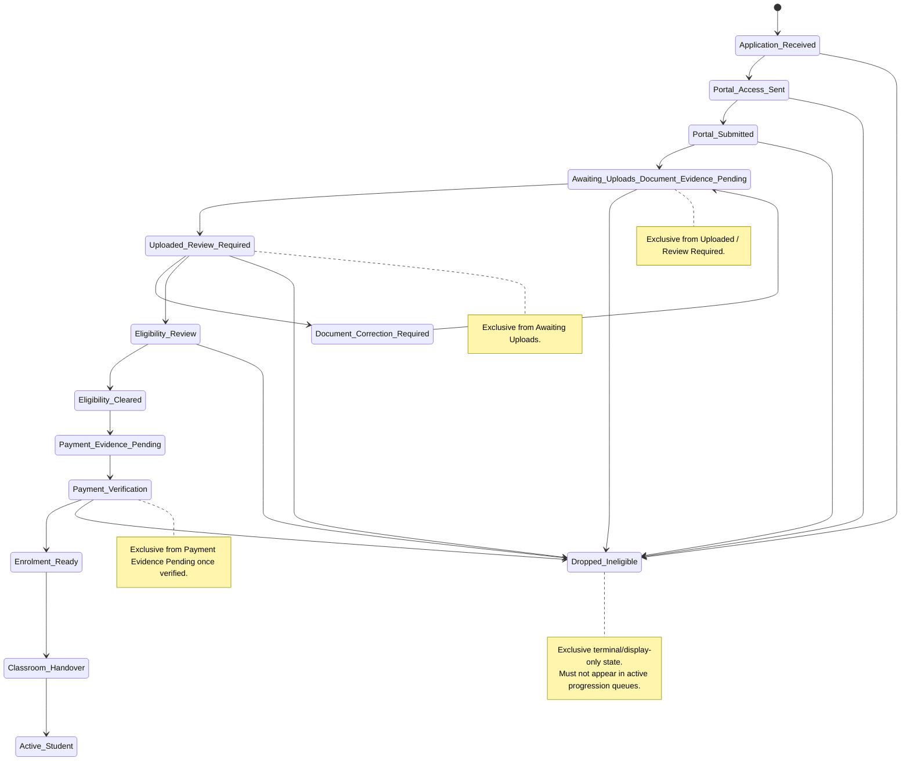
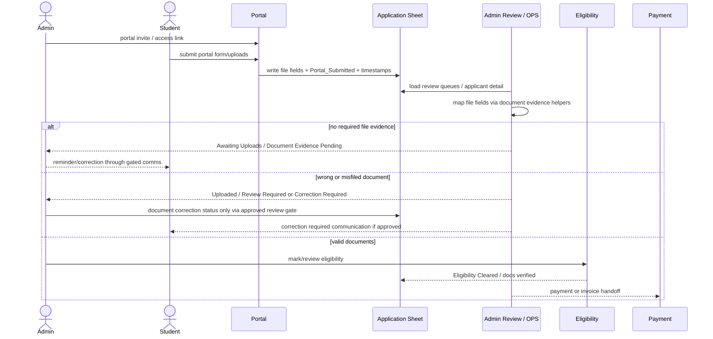

# FODE Architecture Map and Refactor Benchmark — r205

Status: Working design reference for FODE refactor readiness
Baseline: r203 finalized; r204 parked/unfinalized; r205 refactor recommended
Purpose: Provide Codex with a stable benchmark for lifecycle semantics, communications flow, data lineage, and refactor acceptance.

---

## 1. Current Decision

The current decision is to park r204 and refactor first.

Reason: r204 exposed architectural issues in AdminUI.html rather than only a visual bug. The repeated failure pattern was:

- queue classification overlap
- selected-record binding failures
- document/lifecycle semantic confusion
- stage-batch parity not fully restored in OPS
- stale deployment/runtime proof risk
- too much duplicated helper logic inside a large monolithic AdminUI.html

The refactor should begin with a shared row facts / classifier layer before any further Communications UI expansion.

---

## 2. Refactor Guiding Principle

Do not start by splitting the whole application.

Start with a low-risk, testable classifier layer that derives row facts once, then progressively replace duplicate logic.

Target first abstraction:

```javascript
opsBuildRowFacts_(row)
```

This should produce a single row-derived object used by OPS Communications, Lifecycle, Applicant Queue, and later Billing/Portal/Reports.

Suggested shape:

```javascript
{
  applicantId,
  name,
  email,
  hasEmail,
  phone,
  hasPhone,
  hasEmailIssue,
  isRecentlyContacted,
  isCooldownActive,
  documentState,
  paymentEvidenceState,
  paymentVerifiedState,
  lifecycleState,
  isDroppedOrIneligible,
  communicationQueues,
  primaryAction
}
```

---

## 3. Mermaid Applicant Lifecycle State Machine



### Lifecycle exclusivity rules

| State | Exclusive From | Operator Meaning |
|---|---|---|
| Awaiting Uploads / Document Evidence Pending | Uploaded / Review Required, Eligibility Review | Applicant has not supplied enough evidence; do not treat as eligibility work. |
| Uploaded / Review Required | Awaiting Uploads | Files exist and need human review. |
| Document Correction Required | Eligibility Cleared | Uploaded files are wrong, illegible, misfiled, or incomplete. |
| Eligibility Cleared | Awaiting Uploads, Correction Required | Document review passed. |
| Dropped / Ineligible | All active queues | Terminal/display-only or reactivation-controlled state. |

---

## 4. Mermaid OPS Communications Sequence Diagram

```mermaid
sequenceDiagram
  actor Operator
  participant UI as AdminUI OPS Communications
  participant Q as Queue Classification
  participant S as Selection State
  participant E as Email/Phone Extractors
  participant C as Cooldown/Recent Check
  participant W as Queue Send Workflow
  participant B as Backend Gates

  Operator->>UI: click queue
  UI->>Q: classify loaded rows
  Q->>C: evaluate recent contact / cooldown
  Q-->>UI: filtered records + counts

  Operator->>S: select one or many records
  S->>E: derive email / phone
  S->>W: render selected pane + workflow
  W-->>Operator: single applicant fields OR bulk cohort counts

  Operator->>UI: preview selected
  UI->>B: existing preview path / stage batch preview
  B-->>UI: preview result or block reason
  UI->>W: preview status, diagnostics, next step

  Operator->>UI: send/export attempt
  UI->>B: role + preview + confirmation + backend gate
  alt gate blocked
    B-->>UI: blocked
    UI-->>Operator: no send/export/mutation
  else actual send allowed and confirmed
    B-->>UI: sent result
    B->>B: audit + cooldown/last-contact update
  end

  note over Q,W
    r204 failure points:
    Ready/Cooldown overlap,
    selected count without applicant/email binding,
    and missing workflow markers.
  end note
```

---

## 5. Mermaid Document Upload → Review → Eligibility Sequence



---

## 6. Data Lineage Map

| Visible Label | Source Fields / Signals | Helper / Proposed Row Fact | Risk | Notes |
|---|---|---|---|---|
| effective email | Effective_Email, Corrected_Email, Parent_Email, Email, lowercase aliases | email, hasEmail | High | Must normalize once. |
| phone / WhatsApp | Parent_Phone, Phone, Mobile, WhatsApp aliases | phone, hasPhone | Medium | Display/export only unless governed. |
| email issue | bounce, suppression, invalid/missing/correction fields | hasEmailIssue | High | Blocks direct email send. |
| cooldown / recently contacted | last contact fields, next-action date, cooldown flags | isRecentlyContacted, isCooldownActive | High | Must exclude actionable queues. |
| lifecycle stage | portal/docs/payment/enrolment/classroom/status fields | lifecycleState | High | Must be exclusive. |
| portal submitted | Portal_Submitted and related timestamp/status fields | portalSubmitted | Medium | Submission is not upload proof. |
| awaiting uploads | missing/pending doc evidence | documentState = awaiting_uploads | High | Must not look like eligibility workload. |
| docs uploaded | file evidence/status | documentState = uploaded_review_required | High | Requires evidence. |
| document correction required | doc review status/comment | documentState = correction_required | High | Indicates uploaded but wrong/illegible/misfiled. |
| eligibility cleared | docs verified/status | documentState = eligibility_cleared | High | Separate from payment. |
| payment evidence | Fee_Receipt_File, Payment_Received | paymentEvidenceState | High | Evidence is not verification. |
| payment verified | Payment_Verified, Payment_Verified_Bool, paymentVerified | paymentVerifiedState | High | Unlock/enrolment implications. |
| ready to contact | email + no issue + no recent/cooldown + not terminal/review-only | communicationQueues.readyToContact | High | Must not overlap cooldown. |
| dropped/ineligible | Overall_Status, Pipeline_Stage, Operational_Stage, CRM_Stage, Stage | isDroppedOrIneligible | Medium | Terminal/display-only unless reactivated. |

---

## 7. OPS Communications Event Map

| Event | Current / Target Function | State Touched | Expected Panel Update | Risk |
|---|---|---|---|---|
| click queue | opsSetCommunicationQueue_ | active queue, selected IDs reset | queue cards, records, workflow | High |
| render records | renderOpsCommunicationWorkQueues_ | queue/filter state | records table + queue inspector | High |
| select one record | opsToggleCommunicationRowSelection_, binding helper | selected IDs, selected applicant globals | ApplicantID/name/email/phone/stage visible | High |
| select multiple records | opsToggleCommunicationRowSelection_ | selected IDs | bulk cohort + recipient counts | High |
| select all eligible | opsSelectAllEligibleCommunicationRows_ | selected IDs from eligible assessment | selected count + loaded/missing counts | High |
| clear selection | opsClearCommunicationSelection_ | selected IDs empty | no selected cohort | Medium |
| preview selected | preview helper / stage batch preview | preview state/result | preview status + diagnostics | High |
| send stage batch | sendStageBatchUi_ | batch state/cache/backend | gated result only | High |
| open email correction | review bridge | selected applicant context | Admin Review handoff | Medium |

---

## 8. Queue Classification Rules

| Queue | Clean Rule | Actionability | Overlap Rule |
|---|---|---|---|
| Ready to Contact | hasEmail AND !hasEmailIssue AND !isRecentlyContacted AND !isCooldownActive AND !terminal/review-only | Actionable | Must exclude cooldown/recent-contact. |
| Missing Documents Reminder Due | awaiting uploads AND due now AND has recipient | Actionable if gated | Must exclude cooldown. |
| Missing Documents Waiting / Cooldown | awaiting uploads AND recent/cooldown | Waiting | Never sendable. |
| Invoice / Payment Follow-Up | payment/invoice pending AND not recent/cooldown AND has recipient | Actionable if gated | Must exclude cooldown. |
| Portal Access / Reminder | portal access needed AND not recent/cooldown AND has recipient | Actionable if gated | Must exclude cooldown. |
| Email Issue / Contact Correction | email issue exists | Manual follow-up | Blocks email queues. |
| WhatsApp Fallback | phone exists AND email missing/blocked | Export/manual | Not direct system send. |
| Cooldown / Recently Contacted | recent contact OR active cooldown | Waiting/blocked | Super-bucket; subtract from all actionable queues. |
| Uploaded / Review Required | file evidence present and unreviewed/correction-needed | Review | Not generic reminder queue. |
| Awaiting Uploads | docs missing/pending | Waiting/reminder split | Must not be called eligibility review. |
| Dropped / Ineligible | terminal status | Display-only | Exclude active queues. |

---

## 9. Known-Case Test Matrix

| Case ID | Scenario | Expected Lifecycle State | Expected Communication Queue | Expected Action | Should Send? |
|---|---|---|---|---|---|
| C01 | Valid email, no cooldown | Active non-review | Ready to Contact | Preview Reminder | Maybe, gated |
| C02 | Valid email, in cooldown | Active waiting | Cooldown / Recently Contacted | Wait / timeline | No |
| C03 | Missing email, phone exists | Contact issue | WhatsApp Fallback | Export/call handoff | No email |
| C04 | Portal submitted, docs missing | Awaiting Uploads | Missing docs due/waiting | Reminder if due | Maybe, gated |
| C05 | Docs uploaded, unreviewed | Uploaded / Review Required | Uploaded / Review Required | Open review | No |
| C06 | Wrong document uploaded | Document Correction Required | Review / Correction | Correction review | No generic send |
| C07 | Receipt uploaded, docs missing | Awaiting Uploads / anomaly | Missing docs or anomaly | Review docs | No payment verify |
| C08 | Payment verified, enrolment not confirmed | Enrolment Ready | Classroom/non-communication | Handover/review | No default applicant send |
| C09 | Dropped / Ineligible | Dropped / Ineligible | none active | Display/review source | No |
| C10 | Bounced email | Email Issue | Email Issue / Contact Correction | Correct email / phone | No |
| C11 | WhatsApp fallback | Manual fallback | WhatsApp Fallback | governed CSV/manual call | No system send |

---

## 10. Refactor Split Plan

### Phase 1 — Shared row facts / classifier
- Extract or consolidate pure UI-side row fact derivation.
- Use first in OPS Communications only.
- No backend changes.
- No send/export behavior changes.

### Phase 2 — Communications module
- Move communications queue classification/rendering behind the shared facts layer.
- Keep old Admin stage-batch backend gates intact.
- Avoid inventing arbitrary selected-row bulk send.

### Phase 3 — Lifecycle / Applicant Queue
- Apply same row facts to lifecycle and applicant queue.
- Enforce exclusive lifecycle semantics.

### Phase 4 — Billing / Portal / Reports
- Extract high-risk sections only after classifier stabilizes.
- Keep all writes gated server-side.

### Phase 5 — Shell modularization
- AdminUI.html remains shell.
- Split include/render units only after logic is stable.

---

## 11. Risk Register

| Risk | Impact | Likelihood | Mitigation |
|---|---|---:|---|
| Single-file bloat | hidden coupling and regressions | High | staged extraction |
| Queue semantic overlap | wrong workload/send risk | High | exclusive classifier + tests |
| Selected-record binding failures | unsafe/blocked preview | High | single source of selection/facts |
| Apps Script version pressure | stale runtime confusion | High | version inventory/cleanup later |
| Stale deployment proof | acceptance against old code | High | remote proof + whoami only |
| Accidental send/export/mutation | live-data harm | Medium | backend gates and no live casual testing |
| Duplicate helper logic | inconsistent labels/counts | High | shared row facts |
| Browser/cache confusion | false pass/fail | Medium | hard refresh + whoami + marker proof |
| File preview proxy issue | document evidence misread | Medium | separate diagnosis; distinguish file evidence/review |

---

## 12. Acceptance Benchmark for r205 Phase 1

PASS only if:

- `opsBuildRowFacts_` or equivalent exists.
- Ready to Contact excludes recent/cooldown rows.
- Cooldown rows are not actionable.
- Email Issue blocks email queues.
- Awaiting Uploads is separate from Uploaded / Review Required.
- One selected row can derive ApplicantID/email/phone/stage from row facts.
- Multi-select recipient counts use row facts.
- No Admin.js / Code.js / Utils.js change is required.
- No send/export/mutation behavior changes.
- r205 does not reapply r204 UI patch wholesale.

---

## 13. Codex Operating Notes

- Treat this file as the benchmark for r205 classifier/refactor work.
- Do not use parked r204 patch as accepted source.
- Use r204 patch only as reference for failed attempts and useful UI ideas.
- Start from restored r203 runtime source.
- Keep Git and release discipline intact.
- Do not proceed to release steps unless acceptance passes.
