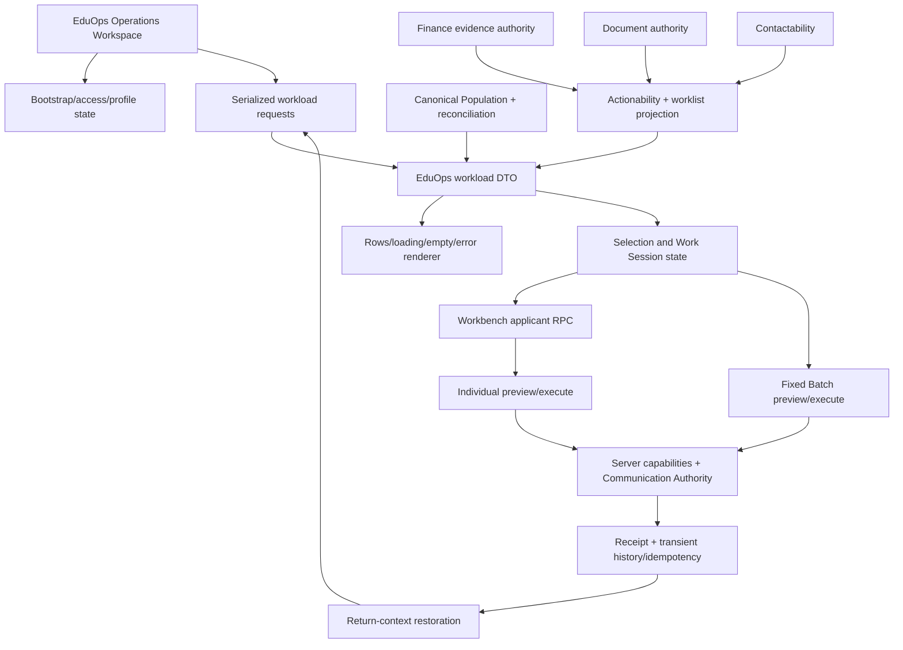

# R391A Full Platform Code, Defect and Architecture Audit

Date: 2026-07-29

Release track: Track L — documentation and read-only analysis

Runtime release: No
Verdict: `CRITICAL_REPAIR_REQUIRED`

## 1. Executive decision

R390B1 is cleanly closed and its bounded communication-safety changes should be retained. The accepted baseline is:

| Surface | Accepted identity |
|---|---|
| Git `HEAD` / `origin/main` | `613e21b67b1b724dc437fcef8458e7f0d9988e61` |
| Admin | `@426 / r390 / 390` |
| Student | `@247 / r217 / 217` |
| Production | Untouched |
| Git ahead / behind at audit start | `0 / 0` |
| Git state at audit start | Clean |

The platform must not proceed directly to R390B2. Work Session and Workbench navigation can issue overlapping applicant reads without a request generation or applicant-response guard. A late response can replace the Workbench after the session has advanced, so the visible applicant and active session identity can diverge. Server-side mutation gates remain important protection, but they do not make this operator identity defect acceptable.

Two additional client-state defects are source-proven:

- row-dependent controls can restore a previous workload while a newer workload request is pending;
- the workload empty state is forced visible by CSS even when its `hidden` property is true.

The reported `318 matched · 0 visible` is not a population contradiction. The field rendered as `visible` actually counts current-page rows eligible for Batch selection. Twenty-five rows were displayed, zero were Batch-selectable, and 25 were Batch-unavailable. The wording is incorrect and exposes Batch authority as though it were general queue visibility.

R391B, R391C, and their deterministic regression coverage must precede durable Communication Event Ledger work.

## 2. Baseline and differential closure

Comparison:

```text
Previous accepted baseline:
2b5273a7eb178872eb8be05d638b491e20d78404
Admin @425 / r389 / 389

Current accepted baseline:
613e21b67b1b724dc437fcef8458e7f0d9988e61
Admin @426 / r390 / 390
```

R390 changed 27 files: 3,385 insertions and 226 deletions. The complete change set is accounted for below.

| R390 files | Intended and actual effect | Authority / coverage | Audit disposition |
|---|---|---|---|
| `Admin.js`, `Code.js`, `Admin_SelectedApplicantCommunications.js`, `EduOps_Commands.js` | Preserved preview, operation, applicant, row and receipt identity through individual and selected-Batch dispatch; locked execution; separated successful replay from contactability failure; retained attempt 3+ manual review | Communication and Actionability; protected by R390 communication, role, replay, cohort and query-binding tests | Retain; revise only through bounded authority passes |
| `EduOps_Idempotency.js`, `EduOps_Receipts.js`, `Utils.js` | Made transient User Cache authority explicit, normalized exact receipt/history evidence, and stopped presenting transient state as durable | Communication evidence; protected by R390 tests | Retain as an explicit compatibility boundary; replace through a later ledger pass |
| `Config.js` | Advanced Admin identity from `r389 / 389` to `r390 / 390` | Release identity | Retain |
| `EduOps.html`, `EduOps_ClientComponents.html`, `EduOps_ClientCore.html`, `EduOps_ClientWorkbench.html`, `EduOps_Styles.html`, `EduOps_Workload.js` | Reconciled visible Work Session placement, removed legacy KPI rendering, bound command execution payloads, added cached return-context restoration, exposed exact receipts, adjusted global-search type, and described Communication Review | Operations Workspace, Workbench and workload DTO; current Preview Lab suites cover the accepted primary paths | Retain communication fixes. Revise cached restoration, labels, render ownership and request identity as findings below require |
| `AdminUI.html` | Reconciled accepted Admin session and browser contracts | Admin client compatibility | Retain; large legacy client remains a consolidation target |
| `tests/admin-role-capability-convergence.test.js`, `tests/communication-semantic-registry.test.js`, `tests/eduops-batch-execution-truth-r376d.test.js`, `tests/eduops-batch-governance-cohort-parity-repair.test.js`, `tests/eduops-query-binding-batch-hotfix.test.js`, `tests/eduops-r376f-manual-acceptance-hotfix.test.js`, `tests/eduops-r376h-conditional-summary-date.test.js`, `tests/r390b1-communication-safety-repair.test.js` | Updated capability, semantic, fixed-operation, query-binding, receipt and identity contracts | Repository regression coverage | Retain; several tests protect compatibility fields rather than their meaning |
| `tools/eduops-snapshot-capture/server/preview-data.js`, `tools/eduops-snapshot-capture/tests/eduops-preview-clean-start.browser.test.js`, `tools/eduops-snapshot-capture/tests/preview-lab.browser.test.js` | Reconciled Preview Lab fixtures and browser assertions with removed KPI/radio/safety-detail markup and current Batch receipt flow | Deterministic browser harness | Retain; add race, computed-visibility and post-mutation-refresh contracts |
| `docs/audits/R390B1_Communication_Safety_Repair_2026-07-28.md` | Recorded bounded implementation, remote-source proof, identities, hashes and acceptance evidence | Audit evidence | Retain |

No R390 diff changes Finance settlement authority, lifecycle policy, Zoho mutation, Classroom mutation, portal policy, Registry policy, Academic policy, Student deployment or Production deployment. Finance-related presentation remains separate from settlement mutation authority. Browser-harness reconciliation did not introduce an unrelated live-data mutation path.

## 3. Critical and high findings

### R391A-CLIENT-01 — Workbench response can diverge from active Work Session identity

- **Domain:** Client state, Work Session, Workbench
- **Evidence:** `app.openWorkbench()` in `EduOps_ClientWorkbench.html:331-358` sends `eduops_getApplicantWorkbench` without a generation token, active-request identity or stale-response rejection. Every success replaces `app.state.workbench`, title, subtitle and navigation. `navigateApplicant()` at `:88-92` can immediately issue another read. `advanceSession()` in `EduOps_ClientBatch.html:381-390` increments the session index, calls `app.openWorkbench(newId)`, and renders the new session state without disabling subsequent navigation.
- **Affected files:** `EduOps_ClientWorkbench.html`, `EduOps_ClientBatch.html`, `EduOps_ClientCore.html`, Preview Lab browser tests
- **Root cause:** Workload RPCs have last-request-wins serialization, but applicant Workbench RPCs and session transitions do not share an identity or atomic state transition.
- **Severity:** CRITICAL
- **Reachability:** Active through rapid Next, Previous, Skip or other overlapping applicant navigation; deterministic reverse-order responses are sufficient.
- **Authority impact:** The Workbench applicant can differ from the active session row/index. An operator can believe they are processing the session applicant while viewing a late prior response.
- **Data-mutation risk:** Critical conditional risk. Server mutation methods still bind and revalidate applicant/row identities, but an operator can initiate a valid action for the stale displayed applicant rather than the intended current session applicant.
- **Recommended treatment:** Add a monotonically increasing Workbench request generation and expected applicant/row binding; commit a response only when both still match. Make session advancement atomic, disable transitions while an applicant read is pending, and clear or explicitly fail the old Workbench on failure.
- **Proposed implementation pass:** R391B

### R391A-CLIENT-02 — Previous workload can reappear during a newer request

- **Domain:** Client request and render state
- **Evidence:** Workload requests use sequence, active and queued state in `EduOps_ClientCore.html:7-9,423-520`. However, `renderPendingWorkload()` in `EduOps_ClientComponents.html:218-229` clears the rendered rows without invalidating `app.state.workload` or disabling every row-dependent control. Selection handlers at `:1266-1287` read the old workload and directly rerender rows/selection. Work Session creation reads the same old rows in `EduOps_ClientBatch.html:366-373`. A deterministic delayed READY→REVIEW request probe restored READY rows, selection intent and Batch enablement under the requested REVIEW context.
- **Affected files:** `EduOps_ClientCore.html`, `EduOps_ClientComponents.html`, `EduOps_ClientBatch.html`
- **Root cause:** Request generation protects response commits, but UI controls are not gated by the currently rendered generation and phase.
- **Severity:** HIGH
- **Reachability:** Normal workload changes followed by Select visible, Batch or Work Session interaction before the new response settles.
- **Authority impact:** Old rows and an old eligible cohort are shown beneath a newer requested context.
- **Data-mutation risk:** Reduced, not removed, by server Batch revalidation. Operator intent and subsequent navigation can be built from stale rows.
- **Recommended treatment:** Track `renderedRequestId` and context fingerprint; invalidate the previous workload at pending; gate every row-dependent control until the current generation commits.
- **Proposed implementation pass:** R391B

### R391A-CLIENT-03 — Cached return restores stale operational truth after mutation

- **Domain:** Client state, Workbench and Batch return flow
- **Evidence:** `currentWorkloadMatchesReturnContext()` and `restoreReturnContext()` in `EduOps_ClientCore.html:552-588` rerender `app.state.workload` without a server request when query and snapshot fields match. Individual receipt refresh updates the Workbench only. `invalidateOperationAuthority()` does not invalidate workload/snapshot state. `closeWorkbench()` and `closeBatch()` can therefore return to rows classified before the completed operation.
- **Affected files:** `EduOps_ClientCore.html`, `EduOps_ClientWorkbench.html`, `EduOps_ClientBatch.html`
- **Root cause:** R390 optimized context restoration by equating equal query/snapshot identifiers with fresh mutable operational projections.
- **Severity:** HIGH
- **Reachability:** Normal return after a communication, contact, document, Finance or Batch receipt.
- **Authority impact:** Workload classification, availability, selection and row evidence can remain stale after an accepted operation.
- **Data-mutation risk:** Server mutation gates revalidate, but the operator can act from stale operational truth.
- **Recommended treatment:** Mark the workload dirty after every mutation or accepted receipt and requery before enabling workload actions; preserve navigation context separately from cached authoritative results.
- **Proposed implementation pass:** R391B

### R391A-POP-01 — Workload integrity is hard-coded PASS

- **Domain:** Population and reconciliation
- **Evidence:** `canonicalPopulationReconciliation_()` in `Admin_CanonicalPopulation.js:209-250` detects duplicate ApplicantIDs and can return FAIL. `buildCanonicalPopulationFromValues_()` at `:266-310` includes each nonblank ApplicantID row. `eduopsResolveFodeSnapshot_()` in `EduOps_FODE_Adapter.js:78-143` does not retain reconciliation metadata, and `eduopsReconciliationForRows_()` in `EduOps_Workload.js:1442-1495` emits `integrityState: "PASS"` unconditionally. In the duplicate condition, command projection in `EduOps_Commands.js:293` can retain the last canonical row while source lookup in `Admin_SelectedApplicantCommunications.js:452` resolves the first matching row.
- **Affected files:** `Admin_CanonicalPopulation.js`, `EduOps_FODE_Adapter.js`, `EduOps_Workload.js`
- **Root cause:** The adapter reduces the canonical population record to rows and later reconstructs reconciliation without the canonical result.
- **Severity:** HIGH
- **Reachability:** Active whenever duplicate or otherwise failed canonical reconciliation exists. No current duplicate is proved by the owner screenshots, so this is a conditional integrity defect rather than evidence that 318 currently contains duplicates.
- **Authority impact:** The Operations DTO can claim population integrity even when its source authority reported failure.
- **Data-mutation risk:** A displayed/projected duplicate can differ from the source row later evaluated for Batch mutation. Exact applicant checks help, but this first-versus-last mismatch must be made unreachable.
- **Recommended treatment:** Preserve canonical reconciliation end to end and fail workload, command catalogue, preview and execute closed on duplicate/failed integrity; report row count and distinct-applicant count separately.
- **Proposed implementation pass:** R391B

### R391A-CLASS-01 — Communication Review uses applicant-global compatibility cadence

- **Domain:** Communication, Actionability and Review classification
- **Evidence:** `communicationCadenceState_()` in `Code.js:8540-8564` reads applicant-global `Email_Attempt_Count`. If a prior status is SENT, it infers at least one successful send and can lift successful-send count to the global attempt count. At two or more attempts after cooldown, `Admin.js:3188-3210` assigns manual review; `Admin.js:3335-3345` presents Communication Review as two successful send cycles.
- **Affected files:** `Code.js`, `Admin.js`, communication compatibility fields
- **Root cause:** Applicant-global row fields stand in for message-family event sequence and durable outcomes.
- **Severity:** HIGH
- **Reachability:** The owner evidence shows 243 active Communication Review records through this path.
- **Authority impact:** The state is a conservative safety hold, but does not prove two successful sends for the same message family or specify the required human decision.
- **Data-mutation risk:** Low direct mutation risk because the state blocks automation; high operational impact from overbroad or weakly evidenced Review work.
- **Recommended treatment:** Define owner-approved review policy and sequence key before a ledger schema. Until then, label this as a compatibility safety hold and do not imply durable successful cycles.
- **Proposed implementation pass:** R391C, then R390B2

### R391A-CLASS-02 — Contactability can be overridden by document worklist routing

- **Domain:** Cross-authority classification
- **Evidence:** Actionability construction in `Admin.js:3143-3165` permits a contact suppressor alongside raw next action `UPLOAD_REQUIRED_DOCUMENTS` and correctly recommends `FIX_CONTACT_DETAILS`. Worklist projection at `Admin.js:3335-3393` tests upload-required before fix-contact-details and only special-cases the manual suppressor.
- **Affected files:** `Admin.js`, workload classification tests
- **Root cause:** Actionability resolution and worklist projection use different precedence rules.
- **Severity:** HIGH
- **Reachability:** Active for contact-blocked missing-document rows; the owner composition contains a two-record missing-document review-decision subtype consistent with this path, although exact row attribution was not live-tested.
- **Authority impact:** A contactability-blocked applicant can be packaged as Document Follow-up while the canonical recommended action says Fix Contact Details.
- **Data-mutation risk:** Primarily operator routing risk; communication authority still blocks an invalid send.
- **Recommended treatment:** Project worklists from the resolved canonical action/suppressor result, not parallel raw fields; add precedence matrix tests.
- **Proposed implementation pass:** R391C

### R391A-FIN-01 — Finance evidence action is labelled as settlement

- **Domain:** Finance authority presentation
- **Evidence:** The `FINANCE_EVIDENCE_DECISION` option in `EduOps_Workload.js:352` is labelled `Payment verified`. The mutation in `Admin_PaymentAuthority.js:70` writes evidence verification (`Receipt_Status = Verified`), while `Admin_CanonicalFinance.js:126` explicitly distinguishes `PAYMENT_EVIDENCE_VERIFIED` from `PAID_VERIFIED`.
- **Affected files:** `EduOps_Workload.js`, Finance DTO/interaction tests
- **Root cause:** A UI action label collapses payment-evidence verification into the stronger paid-settlement fact even though the backend correctly keeps them separate.
- **Severity:** HIGH
- **Reachability:** Active whenever a Finance Review action is presented, including the one-record Finance subtype in the owner composition.
- **Authority impact:** The write authority remains evidence-only, but the operator is told that payment itself was verified.
- **Data-mutation risk:** The current endpoint does not settle payment; misleading wording can nevertheless cause an operator to rely on a fact the action did not establish.
- **Recommended treatment:** Rename the action/result to `Payment evidence verified`; keep evidence and settlement states visibly and contractually distinct.
- **Proposed implementation pass:** R391C

### R391A-COMM-01 — Two reachable bulk orchestration authorities remain

- **Domain:** Batch communication architecture
- **Evidence:** Individual `admin_sendApplicantMessage` rejects arrays and retains individual capability/preview binding. EduOps fixed `BATCH_COMMUNICATION` routes through `admin_sendSelectedApplicantBatch()` in `Admin_SelectedApplicantCommunications.js`. A separate reachable `admin_sendStageBatch()` remains in `Admin_StageBatchCommunications.js`. Both require Batch capability and Communication Authority but use different cohort, idempotency and accounting paths.
- **Affected files:** `Admin_SelectedApplicantCommunications.js`, `Admin_StageBatchCommunications.js`, `EduOps_Commands.js`
- **Root cause:** A newer selected-query Batch path was added beside the historical Stage Batch execution path without naming one canonical bulk orchestrator.
- **Severity:** HIGH
- **Reachability:** Both are explicit callable server paths; ordinary individual RPCs do not become bulk merely from client selection.
- **Authority impact:** Bulk send authority is guarded but duplicated, which makes durable sequencing and receipt ownership ambiguous.
- **Data-mutation risk:** High if the paths later diverge; no unauthorized R390 send was observed or performed.
- **Recommended treatment:** Owner must select the canonical bulk command boundary and define how the other path delegates or retires before ledger events are designed.
- **Proposed implementation pass:** R391H decision, then R390B2 implementation

### R391A-COMM-02 — Communication history and idempotency remain transient

- **Domain:** Communication evidence architecture
- **Evidence:** `EduOps_Idempotency.js` reports `idempotencyAuthority: TRANSIENT_USER_CACHE` and `durableIdempotency: false`. `EduOps_Receipts.js` retains operation history in User Cache. Applicant row fields and cooldown cache remain compatibility projections rather than a message-sequence ledger.
- **Affected files:** `EduOps_Idempotency.js`, `EduOps_Receipts.js`, `Code.js`, applicant communication row fields
- **Root cause:** R390B1 repaired immediate identity/replay semantics without introducing the deferred durable event store.
- **Severity:** HIGH
- **Reachability:** Active for every command receipt, replay window, cooldown and operation-history lookup.
- **Authority impact:** Exact current receipts are improved, but long-lived sequence, outcome and replay evidence is not authoritative.
- **Data-mutation risk:** Locks, preview binding and server revalidation lower immediate duplicate-send risk; expiration still prevents durable proof.
- **Recommended treatment:** Retain explicit transient labels. Design the ledger only after R391B/C fixes, canonical bulk-boundary decision and sequence/retention owner decisions.
- **Proposed implementation pass:** R390B2 after R391 prerequisites

## 4. Complete finding register

The critical and high findings above contain their full classification fields. Remaining findings follow the same required schema.

### R391A-RENDER-01 — Hidden empty state is displayed with successful rows

- **Domain:** Render-state ownership and CSS
- **Evidence:** `EduOps.html:274-278` defines the empty element. Success/pending/error renderers toggle `.hidden` in `EduOps_ClientComponents.html:199-243`, but `EduOps_Styles.html:1981-1984` applies `.eduops-empty-state { display: grid; }` and has no `[hidden]` override. A deterministic full-fixture probe after 25 rows rendered returned `hidden: true`, computed `display: "grid"`, visible true and `rowCount: 25`. `renderBootstrapError()` at `EduOps_ClientComponents.html:297-307` also lacks an explicit empty reset.
- **Affected files:** `EduOps.html`, `EduOps_ClientComponents.html`, `EduOps_Styles.html`, Preview Lab tests
- **Root cause:** Author CSS overrides the HTML hidden presentation while renderers assume the property alone owns visibility.
- **Severity:** MEDIUM
- **Reachability:** Every successful nonempty render; it appears intermittent because the empty block may sit outside the visible scroll area.
- **Authority impact:** None to server truth; material contradiction in operator presentation.
- **Data-mutation risk:** Low.
- **Recommended treatment:** Add an explicit hidden invariant and make loading/success/empty/error/bootstrap-error mutually exclusive render states.
- **Proposed implementation pass:** R391B

### R391A-DTO-01 — `visible`, `unavailable` and `authority-blocked` expose Batch selectability as queue truth

- **Domain:** Workload DTO and UI terminology
- **Evidence:** `EduOps_Workload.js:1384-1385,1469-1477` sets actual `visiblePageCount = pageRows.length`, but splits page and matched rows using `row.selectable`. `EduOps_ClientComponents.html:167-172` renders `visibleSelectable` as `visible`; `:1201` renders all matched nonselectable rows as `Authority-blocked in current view`.
- **Affected files:** `EduOps_Workload.js`, `EduOps_ClientComponents.html`, DTO contract tests
- **Root cause:** Batch-selection compatibility fields are consumed as general workload visibility/actionability.
- **Severity:** MEDIUM
- **Reachability:** Active in the owner screenshot: 318 matched, 25 displayed, 0 Batch-selectable on the page, 25 Batch-unavailable, 318 Batch-nonselectable across the query.
- **Authority impact:** Does not change authority, but misstates what authority decided. Individual Review, Contactability, Finance and document actions can still be supported.
- **Data-mutation risk:** Low.
- **Recommended treatment:** Introduce `displayedPageCount`, `batchSelectableOnPage`, `batchUnavailableOnPage`, `batchSelectableMatched` and `batchBlockedMatched`; retain aliases only in a versioned adapter during migration.
- **Proposed implementation pass:** R391C

### R391A-DTO-02 — Page and advanced-filter projections use incompatible names/shapes

- **Domain:** Workload DTO and filters
- **Evidence:** `matchingOnLaterPages = totalMatched - pageRows.length` in `EduOps_Workload.js:1473` includes earlier pages when page > 1. `visiblePageRange` uses the requested page although server paging is clamped earlier. Canonical document, Finance and contactability facts are nested under `authorityState` in `EduOps_FODE_Adapter.js:191-212`, while filtering and option production in `EduOps_Workload.js:1089-1093,1366-1371` read absent top-level fields and inconsistently use `blockerCode` versus `reasonCode`.
- **Affected files:** `EduOps_FODE_Adapter.js`, `EduOps_Workload.js`
- **Root cause:** Internal row normalization and public compatibility naming evolved separately.
- **Severity:** MEDIUM
- **Reachability:** Supported advanced filters can show no options or return zero matches for valid canonical rows; page wording drifts on later pages.
- **Authority impact:** Filtered workload can omit valid rows without changing their canonical state.
- **Data-mutation risk:** Low direct; operator omission risk.
- **Recommended treatment:** Normalize one internal row shape before filter/option construction; bind response reconciliation to the effective page; rename later-page count to outside-current-page or split before/after.
- **Proposed implementation pass:** R391C

### R391A-UI-01 — Package-panel mode controls do not own a mode

- **Domain:** Operations Workspace component behavior
- **Evidence:** `EduOps_ClientComponents.html:57` renders Compact, Expanded and Hidden. `EduOps_ClientOperationsWorkspace.html:89-93` only handles Expanded by scrolling the workspace into view. Compact has no mode action and Hidden has no handler, state, ARIA change or CSS mode.
- **Affected files:** `EduOps_ClientComponents.html`, `EduOps_ClientOperationsWorkspace.html`, Operations Workspace styles/tests
- **Root cause:** Presentation controls were emitted before a component-state contract was implemented.
- **Severity:** MEDIUM
- **Reachability:** Visible, supported controls in the accepted Admin UI.
- **Authority impact:** None.
- **Data-mutation risk:** None.
- **Recommended treatment:** Either implement explicit COMPACT/EXPANDED/HIDDEN state and interaction tests or remove unsupported controls.
- **Proposed implementation pass:** R391C

### R391A-CLIENT-04 — Bootstrap retries can complete out of order

- **Domain:** Client initialization and recovery
- **Evidence:** Two retry controls call the same bootstrap at `EduOps_ClientComponents.html:304,307,1621-1622`. `startBootstrap()` in `EduOps_Client.html:127-151` has no in-flight generation, while `applyBootstrap()` at `:71-120` mutates shared defaults and state.
- **Affected files:** `EduOps_Client.html`, `EduOps_ClientComponents.html`
- **Root cause:** Workload serialization was not extended to bootstrap access/profile requests.
- **Severity:** MEDIUM
- **Reachability:** Double retry or a slow prior retry followed by another attempt.
- **Authority impact:** A late bootstrap can reset client defaults or replace a newer success with failure presentation; server authorization remains authoritative.
- **Data-mutation risk:** Low.
- **Recommended treatment:** Single-flight bootstrap generation and reverse-order success/failure regression coverage.
- **Proposed implementation pass:** R391B

### R391A-CAP-01 — Contact-edit presentation and mutation capabilities do not converge

- **Domain:** Security and capability projection
- **Evidence:** The outer EduOps command surface requires `CAN_OPEN_REVIEW_WORKSPACE` in `EduOps_Commands.js:5`, while the inner contact mutation path requires an Operations/Batch-related capability in `Admin.js:2002` and `Admin_AccessControl.js:332`.
- **Affected files:** `EduOps_Commands.js`, `Admin.js`, `Admin_AccessControl.js`
- **Root cause:** The client command catalogue and mutation endpoint reuse capabilities defined for adjacent workflows rather than one dedicated contact-edit authority.
- **Severity:** MEDIUM
- **Reachability:** A caller can be shown a contact repair action that the inner endpoint correctly rejects.
- **Authority impact:** Fail-closed capability drift; no bypass was found.
- **Data-mutation risk:** Low because the stronger inner guard remains authoritative.
- **Recommended treatment:** Define and project one dedicated contact-edit capability; align catalogue, preview and mutation checks without weakening the endpoint.
- **Proposed implementation pass:** R391C

### R391A-PERF-01 — Admin and Workbench hot paths repeat full-sheet work

- **Domain:** Performance
- **Evidence:** Admin startup calls `loadStageDashboard()` and then `loadReviewQueues()` at `AdminUI.html:15004`; `loadReviewQueues()` calls `loadStageDashboard()` again at `:9649`. `admin_getStageAggregation()` reads the full sheet in `Admin.js:4264`. Review queue loads also call `loadOpsLifecycleSummary_()` at `AdminUI.html:9650`, whose server path scans the sheet at `Admin.js:4516`. Each `eduops_getApplicantWorkbench` resolves a snapshot and then calls `admin_getCanonicalApplicant()`, which reads/loops the full data range at `Admin_CanonicalPopulation.js:682-700`, followed by an additional detail lookup in `Admin.js`.
- **Affected files:** `AdminUI.html`, `Admin.js`, `Admin_CanonicalPopulation.js`, `EduOps_FODE_Adapter.js`
- **Root cause:** Legacy dashboard/OPS hydration remains coupled to current routes, and Workbench exact reads do not reuse the resolved snapshot index.
- **Severity:** MEDIUM
- **Reachability:** Every Admin startup/review load and every Work Session applicant navigation.
- **Authority impact:** None, but latency widens race windows and harms queue operation.
- **Data-mutation risk:** None.
- **Recommended treatment:** Remove duplicate startup hydration, restrict retired OPS summary to its compatibility route, and resolve Workbench identity from the snapshot index before one exact-row read.
- **Proposed implementation pass:** R391B for Workbench latency; R391H for legacy route consolidation

### R391A-TEST-01 — Browser harness is current-path aligned but not an architecture contract

- **Domain:** Tests and fixtures
- **Evidence:** Primary and clean-start suites cover fixed Batch operation, one Work Session advance, failure/retry and three viewports. They do not test reverse-order Workbench responses, pending-state control activation, post-receipt workload refresh, computed empty-state visibility, concurrent bootstrap retry, package modes or all advanced filters. Clean-start checks `emptyState.hidden`, not computed visibility. `owner-proxy-acceptance.browser.test.js` still expects retired operation-radio markup. Some snapshot defaults remain `r352`/`r365` while accepted runtime is `r390`.
- **Affected files:** Preview Lab browser tests, request-state browser tests, operations snapshot tools/fixtures
- **Root cause:** R390 reconciled the primary release path but retained markup-oriented and historical fixture contracts.
- **Severity:** MEDIUM
- **Reachability:** Release gates can pass while the client races and CSS contradiction remain.
- **Authority impact:** False assurance rather than direct authority change.
- **Data-mutation risk:** Indirect.
- **Recommended treatment:** Add deterministic generation/reverse-order tests and semantic DTO assertions; version historical fixtures explicitly; retire stale selectors.
- **Proposed implementation pass:** R391G, with blocker regressions delivered in R391B/C

### R391A-GOV-01 — Canonical runtime and architecture documents drift from R390

- **Domain:** Governance and tooling
- **Evidence:** `runtime-context.json` expects Admin `r354 / 354` and records last release `r347`; `CURRENT_TASK.md` remains at `r212`; `docs/architecture/README.md` cites older V1/Admin identities; `Data_Source_Authority_Register.md` and `Governance.md` retain r23-era status; `tools/README.md` examples use Admin r285; `LIVE_URLS.md` has usable URLs but no current pin/identity. `docs/tooling/Runtime_Context.md` calls the stale runtime context the tooling source of truth. `AGENTS.md` correctly identifies the D: repo and E: archive boundary.
- **Affected files:** The governance files named by the CIS plus `CURRENT_TASK.md`
- **Root cause:** Volatile identities are duplicated across documents and were not refreshed with successive releases.
- **Severity:** MEDIUM
- **Reachability:** Release tooling and operators can compare against incorrect expected identity.
- **Authority impact:** Documentation/tooling authority is contradictory; live `whoami` remains runtime truth.
- **Data-mutation risk:** Indirect release risk.
- **Recommended treatment:** Apply a separately reviewed governance refresh after correctness passes, reduce duplicated volatile identifiers and add Preview Lab/backup/restore governance.
- **Proposed implementation pass:** R391J

### R391A-ARCH-01 — Duplicate global helpers and route-wide client bundles obscure ownership

- **Domain:** Module architecture
- **Evidence:** `actionabilityOwnerLabel_()` is declared twice with different mappings in `AdminUI.html:10087,10172`; the latter silently wins. `makeDebugId_()` exists in both `Admin.js:4` and `Utils.js:44` with different fallbacks in the Apps Script global namespace. Admin, OPS and Operator Next route through the large shared `AdminUI.html` template from `Code.js:557`.
- **Affected files:** `AdminUI.html`, `Admin.js`, `Utils.js`, `Code.js`
- **Root cause:** Compatibility generations share globals and one client shell without enforced module ownership.
- **Severity:** MEDIUM
- **Reachability:** Active; the first duplicate mapping is unreachable while both global helper definitions are load-order dependent.
- **Authority impact:** Current evidence shows label/debug ambiguity, not an authorization bypass.
- **Data-mutation risk:** Low.
- **Recommended treatment:** Consolidate duplicate helpers after behavior tests; split route shells/controllers only after R391B/C stabilize semantics.
- **Proposed implementation pass:** R391H

### R391A-CSS-01 — Visual hierarchy depends on monolithic source-order overrides

- **Domain:** CSS and visual system
- **Evidence:** `EduOps_Styles.html` contains base plus later release-specific overrides for shell, main layout, typography and KPI/package remnants. Package-list rules are also duplicated in `EduOps_OperationsWorkspaceStyles.html`. Fixed viewport heights, nested scroll owners, sticky layers, dense quick-queue cards and widespread 700/800 weights match the owner screenshots.
- **Affected files:** EduOps style modules and component markup
- **Root cause:** Incremental release overrides were appended without stable component tokens or layout ownership.
- **Severity:** LOW
- **Reachability:** Visible at accepted desktop widths; labels truncate and top/search/runtime layers consume excessive space.
- **Authority impact:** None.
- **Data-mutation risk:** None.
- **Recommended treatment:** After semantic repairs, define shared spacing/type/weight tokens, one primary scroll owner, responsive shell hierarchy, minimum queue-card content rules and Workbench progressive disclosure.
- **Proposed implementation pass:** R391D and R391E

### R391A-OBS-01 — Partial reads and correlation are not uniformly observable

- **Domain:** Error handling and observability
- **Evidence:** Workload requests expose client/server timing and suppress stale workload responses. Communication receipts preserve operation/preview/receipt identity. In contrast, Workbench reads can catch detail-read failure and continue from canonical summary, and applicant/bootstrap requests lack comparable generation/correlation. Transient history expires by design.
- **Affected files:** `EduOps_FODE_Adapter.js`, client request modules, receipt/idempotency modules
- **Root cause:** Error/correlation contracts are implemented per feature rather than at a shared RPC boundary.
- **Severity:** LOW
- **Reachability:** Partial detail failure, overlapping applicant/bootstrap calls and expired cache history.
- **Authority impact:** Can obscure degraded evidence without currently proving false mutation success.
- **Data-mutation risk:** Low.
- **Recommended treatment:** Standardize request ID, expected entity binding, phase, safe operator message and diagnostic cause for every client RPC; never return a success shape for an incomplete authoritative mutation.
- **Proposed implementation pass:** R391B and R391H

## 5. Population and Review decision table

The owner composition is arithmetically complete:

```text
243 Communication review
 65 Contact issues
  7 Document review
  2 Missing-document review decisions
  1 Finance verification
---
318 Needs review
```

The canonical population screenshot also reconciles `318 matched + 18 outside current view = 336 population` and `25 displayed + 293 outside current page = 318 matched`. This is row arithmetic, not independent proof of unique ApplicantIDs because of R391A-POP-01.

| Review subtype | Resolver fact / owner | Operator meaning | Decision |
|---|---|---|---|
| Communication review (243) | Actionability from Communication cadence compatibility fields | Conservative manual hold after inferred 2+ send cycles and expired cooldown | Numerically explainable but not durable message-sequence truth; label/policy repair required |
| Contact issues (65) | Contactability suppressor through Actionability | Repair effective contact path before communication | Operationally meaningful; must win worklist routing |
| Document review (7) | Document/review authority | Human document decision | Canonical Review work |
| Missing-document review decisions (2) | Document next action plus suppressor/projection | Current projection can disagree between document follow-up and contact repair | Cross-authority precedence must be repaired |
| Finance verification (1) | Finance evidence verification authority | Verify evidence; not settlement | Canonical Review work, but current `Payment verified` action label overstates the mutation |

`Needs review = 318` is therefore correct as the current non-overlapping Actionability umbrella and too broad/misleading as a single operational story. At least the 243 Communication Review records depend on global compatibility evidence, and the contact/document projection can route a subset inconsistently. No evidence justifies moving records merely to rebalance the dashboard.

Finance separation remains coherent: payment evidence presence and verification do not equal paid settlement; the Finance workspace and capability remain distinct from settlement mutation and Zoho Books authority. Review wording must continue to say evidence verification, never payment settlement.

## 6. Workload DTO semantic trace

| Field / producer | Actual meaning | Consumer wording | Accuracy / treatment |
|---|---|---|---|
| canonical population from `Admin_CanonicalPopulation.js` | Nonblank ApplicantID rows, with separate duplicate reconciliation | Population / canonical population | Accurate only when reconciliation is propagated |
| `totalMatched` in `EduOps_Workload.js` | Rows matching state/worklist/scope/filter query | Matched | Accurate |
| `visiblePageCount = pageRows.length` | Rows rendered on the effective page | Composition: Visible page | Accurate; should be the only general `visible/displayed` count |
| `visibleSelectable` | Current-page rows whose Actionability projection permits Batch selection | Compact: visible; detailed: selectable | Data internally consistent, compact label false |
| `visibleBlocked` | Current-page rows not Batch-selectable | Unavailable | Misleading outside Batch context |
| `totalAuthoritySelectable` | All matched rows Batch-selectable | Authority-selectable | Batch-specific; name should say Batch |
| `totalAuthorityBlocked` | All matched rows not Batch-selectable | Authority-blocked in current view | False scope and overly broad authority claim |
| `matchingOnLaterPages` | `totalMatched - current page row count` | Matching on later pages | False on page > 1; actually outside current page |
| `excludedFromOperation` | Matched rows not selectable for the fixed operation | Excluded / hidden reasons | Not operator selection exclusions; operation-specific |
| selection intent | Explicit selected IDs or matching-query intent before execution | Selected / excluded | Correctly distinct from server execution authority |
| execution authority | Server-side capability, cohort, applicant/row and Communication Authority evaluation | Evaluated only in Batch Operations | Correct separation; keep |

## 7. Client/render ownership and architecture



The workload response path has one principal row/empty renderer and last-request-wins RPC control. The owner contradiction is not evidence of two row writers; it is a CSS visibility violation. Competing state ownership still exists at a broader level:

- row controls can rerender `app.state.workload` while request management owns a newer pending context;
- Work Session owns index/current intent while Workbench independently commits applicant responses;
- mutation receipts update Workbench/Batch state while cached return-context code owns the subsequent workload;
- bootstrap access/profile state has no generation guard.

Pending and ordinary error renderers clear prior rows. A previous empty state can survive successful rows because CSS defeats `hidden`; previous rows can be deliberately restored during pending by row-dependent controls; cached pre-mutation rows can survive a completed operation.

## 8. Operations Workspace and Workbench assessment

### Operations Workspace

- The Actionability partition and worklist arithmetic are internally reconcilable.
- Queue wording conflates Batch selection with general visibility/actionability.
- Expanded/Hidden package controls have no component-mode implementation.
- The global search/top shell/runtime/snapshot layers are too tall and overlap at accepted widths.
- Quick queues need content-aware sizing or two-line labels rather than truncating the operational fact.
- The layout has multiple nested scroll containers and source-order CSS overrides.
- Work Session control placement is now visible and should be retained.

### Individual Workbench

- The owner screenshot shows coherent authority fields for the displayed applicant.
- The header repeats several facts and is vertically heavy; visual refinement is lower priority than request identity.
- Primary action derives from the authoritative backend target; communication remains separately gated.
- Previous/next and Work Session navigation are not atomic with Workbench RPC completion.
- After mutation, Workbench may refresh while the return workload remains cached and stale.
- Exact row/applicant/operation/receipt binding added in R390 should be retained.

### Batch and security

- Individual send endpoints reject array/bulk substitution.
- Fixed `BATCH_COMMUNICATION`, selection intent, query binding, capability checks and server execution revalidation remain separate.
- Successful replay is not converted to contactability failure; successful prior sends are no longer written as `SUPPRESSED`.
- Attempt 3+ remains a manual safety hold.
- Client state cannot directly substitute for server capability or Communication Authority.
- The two explicit bulk orchestrators and transient event evidence still prevent a clean durable-ledger boundary.
- No source-proven Principal/Finance capability bypass, portal-secret leak, signed-route bypass or client-supplied authorization bypass was found in this pass.

## 9. Dead-code and compatibility candidate register

| Candidate | References / historical purpose | Runtime reachability and tests | Removal risk / proof required |
|---|---|---|---|
| Retired KPI card renderer/styles | R390 removed `renderKpis` and click handling; `.eduops-kpi-card*` styles remain | No production producer found; primary browser test asserts no KPI buttons | Low. Remove styles after reference graph and viewport suite pass |
| Empty hidden KPI/summary shell | `#eduopsKpis`, legacy workload summary, `clearLegacyKpis()` and invisible refresh binding | Shell and clearing/binding code remain reachable but produce no cards | Medium. Remove markup, cache, handler and tests together |
| `whoami_admin.html` captured sign-in page | 1,051,628-byte captured Google Accounts page; actual whoami comes from `Routes.js` | No runtime reference found, but deployable-file contract and `.claspignore` intentionally retain it | Medium release-set risk. Verify remote file contract and deployment expectations before removal |
| Package Hidden/Expanded controls | Historical package presentation intent | Visible and reachable; behavior missing | Defect, not dead. Implement or explicitly retire |
| First duplicate `actionabilityOwnerLabel_()` | Older owner-label mapping in `AdminUI.html` | Unreachable because later same-scope declaration wins | Low after mapping contract chooses canonical labels |
| Duplicate `makeDebugId_()` | Admin/Utils compatibility helpers | Both globally loadable; winner depends on Apps Script load order | Consolidate only after caller/fallback tests |
| `OPSEDU_*` DTO/schema names | Prior OpsEdu naming generation | Actively produced/consumed and protected by tests | Not dead. Migrate through versioned adapter |
| OPS lifecycle summary | Historical OPS operational surface | Still called during normal Review queue load | Not dead. Contain caller first, then prove reachability |
| Operator Next and legacy Admin routes | Historical/fallback operator surfaces | Still routed from the shared template and covered by tests | Not dead; needs explicit owner retirement decision |
| Retired operation radios/safety details | Older Batch harness contract | Production primary path removed; `owner-proxy-acceptance.browser.test.js` still references radio markup | Retire stale fixture/test selector after confirming no release wrapper invokes it |

No RPC or branch is declared dead solely from text search. KPI card production and the first duplicate same-scope function are the only source-proven unreachable production behaviors in this pass; their surrounding shells/contracts remain reachable.

## 10. Test and fixture assessment

Accepted evidence:

- full repository suite: 75/75 PASS;
- deployable Apps Script contract: PASS;
- Preview Lab primary browser suite: PASS;
- Preview Lab clean-start suite: PASS;
- remote-source verification and hashes: PASS;
- no Gmail send or operational mutation.

The current primary harness is aligned with the accepted R390 path, but it is not yet a sufficient architecture contract. Required deterministic additions:

1. reverse-order Workbench A→B responses and rapid/double session navigation;
2. every row-dependent control activated during a delayed superseding workload request;
3. computed style/visibility for rows, loading, empty and error—not only `.hidden`;
4. post-individual and post-Batch receipt return with changed server DTO;
5. concurrent bootstrap retries resolving in reverse order;
6. compact/expanded/hidden package mode behavior;
7. canonical nested authority fields through every advanced filter;
8. semantic assertions that displayed and Batch-selectable counts are distinct;
9. duplicate population reconciliation propagated as fail-closed;
10. removal or versioning of retired selectors and r352/r365 “current” fixture labels.

Tests should favor state transition and semantic DTO contracts over incidental DOM structure. Historical captures must be labelled historical rather than current.

## 11. Governance drift

Governance is not runtime truth and was not edited. Main corrections required in R391J:

- make accepted live `whoami` identity the release check and update stale `runtime-context.json` expectations;
- reconcile architecture README, Governance and Data Source Authority status with the current Population, Actionability, Finance and Communication boundaries;
- document Preview Lab primary/clean-start ownership and deterministic-versus-captured fixture rules;
- document backup/restore and rollback evidence requirements;
- keep deployment URLs canonical while avoiding repeated volatile IDs;
- remove old OpsEdu/Operator Next statements only after actual route retirement;
- preserve the D: authoritative repo and E: archive boundary already correct in `AGENTS.md`.

The separately prepared governance-refresh files were neither included in R390 closure nor applied during R391A.

## 12. Ranked remediation sequence

| Pass | Objective and likely files | Boundary / risks / tests | Release and dependencies / owner decisions |
|---|---|---|---|
| **R391B — Critical correctness and client-state repair** | Workbench/applicant generations, atomic session transitions, pending control gates, post-mutation workload invalidation, explicit render-state ownership, bootstrap generation, population reconciliation propagation. Likely Workbench, Batch, Core, Components, Client, FODE Adapter, Workload and focused tests/fixtures | Preserve server authority; risk is navigation/return regression. Add all race, computed-visibility, stale-return and reconciliation tests | Track H runtime release. First. Owner decision: whether session navigation queues or rejects while pending |
| **R391C — Queue semantics and terminology repair** | Canonical worklist precedence; Communication Review compatibility wording/policy; displayed versus Batch-selectable DTO; advanced filters; effective-page reconciliation; package-mode decision | Actionability/Communication/workload contract. Add decision matrices, DTO version/alias and browser wording tests | Track H if backend projection changes. Depends on R391B. Owner decisions: review policy, package modes, compatibility alias lifetime |
| **R391G — Test and fixture architecture consolidation** | Make deterministic architecture tests the release contract; version historical captures; remove retired selectors and redundant markup assertions | No runtime authority; risk is losing valid historical coverage | Track L if tests/tools only. Blocker regressions must land with B/C; consolidation follows |
| **R391D — Operations Workspace density and hierarchy** | Reduce shell height, clarify queue hierarchy, content-aware quick queues, one scroll owner, spacing/type tokens | Visual only if semantics are already fixed; viewport/browser acceptance | Track L runtime UI release as scoped by its CIS. Depends on R391C |
| **R391E — Individual Workbench refinement** | Reduce duplicated facts and vertical density; improve tab/action hierarchy without changing authority | Preserve exact applicant/row/action binding and mutation gates | Track L only if purely visual; otherwise Track H. Depends on R391B |
| **R391F — Proven-dead-code and compatibility retirement** | Remove proven KPI renderer/styles/shell, stale selectors, captured whoami artifact and superseded helpers after proof | Deployable file set and route compatibility are the main risks | Runtime/release requirements depend on files. Depends on R391G and owner route decisions |
| **R391H — Module and authority consolidation** | Choose one bulk orchestrator; isolate route shells; move communication/Finance/Zoho policy from broad globals; consolidate duplicate helpers and hot-path hydration | High authority and regression risk; no behavior change should be mixed with relocation | Track H. Only after B/C/G. Owner decision: canonical bulk boundary |
| **R391J — Governance and canonical-reference refresh** | Reconcile runtime context, architecture, URLs, tooling and Preview Lab governance | Documentation/tooling only | Track L, no runtime release. After accepted identities and authority decisions stabilize |
| **R390B2 — Durable Communication Event Ledger** | Durable operation/message sequence, outcomes, idempotency, retention and projections | Communication mutation/evidence authority; migration and rollback required | Track H. Only after R391B/C blocker repairs, core R391G tests, and bulk/sequence/retention owner decisions |

## 13. Mandatory audit answers

1. **Is `Needs review = 318` semantically correct?** It is a correct current Actionability umbrella and an arithmetically non-overlapping row partition. It is not fully satisfactory operational semantics: 243 records use global compatibility cadence and some contact/document routing can disagree. Duplicate uniqueness is not guaranteed until reconciliation is propagated.
2. **Why are 243 Communication Review?** A prior SENT state plus applicant-global attempt count of two or more, after cooldown, is converted to manual review. This is a conservative hold, not durable proof of two successful same-family sends.
3. **What does `visible` mean?** In the compact summary it means current-page Batch-selectable, not rendered. The actual displayed count is `visiblePageCount`.
4. **What does `authority-blocked` mean?** All matched rows whose Actionability projection marks them nonselectable for the fixed Batch operation. It does not mean no supported individual action and is not limited to the current page.
5. **Why can rows and empty state appear together?** Author CSS forces `.eduops-empty-state` to `display:grid` even when `hidden=true`. The state may be below the viewport, making observation intermittent.
6. **Why is Expanded unresponsive?** Its only handler scrolls to the workspace; no expanded mode exists. Compact and Hidden likewise do not own supported mode behavior.
7. **Are there competing render/state owners?** One main workload row/empty renderer exists, but workload request, cached workload, selection/session, Workbench, receipt return and bootstrap modules compete through global mutable state without a common generation/phase contract.
8. **Can Work Session display or act on the wrong applicant?** Yes. Overlapping Workbench responses can commit out of order after session index changes. This is the critical finding.
9. **Is Batch authority cleanly separated from ordinary visibility?** Server execution remains separate and revalidated; ordinary individual RPCs cannot become bulk. UI language leaks Batch selectability, and two explicit bulk orchestration paths remain.
10. **Which compatibility paths remain reachable?** Applicant-global attempt/status fields, transient cache receipts/idempotency, `OPSEDU_*` schemas, empty KPI/summary shells, OPS lifecycle hydration, legacy Admin/Operator Next routes and two bulk command paths.
11. **Which code is proven dead?** KPI card production removed by R390 and the first same-scope duplicate owner-label function. Some residual styles/markup are unproductive but still referenced and require bounded retirement proof.
12. **Necessary versus cosmetic refactors?** Request/entity generations, atomic session state, stale workload invalidation, reconciliation propagation, worklist precedence, DTO semantics and deterministic tests are necessary. Density, weights and vertical hierarchy are cosmetic until those are fixed.
13. **Is the browser harness aligned?** It is aligned with the R390 primary happy/failure paths, but not with the architecture’s concurrency, computed visibility, post-mutation freshness or full DTO semantics.
14. **May R390B2 begin after this audit?** No. Complete and accept R391B, R391C blocker semantics and their deterministic regression gates first.
15. **What must precede the durable ledger?** Critical client identity/state repair; authoritative reconciliation; Review/cadence policy; canonical worklist precedence; canonical bulk boundary; sequence-key and retention decisions; semantic DTO migration; deterministic race/replay/receipt tests.

## 14. Validation and stop-state

Read-only validation and analysis performed:

```text
git status -sb
git rev-parse HEAD
git rev-parse origin/main
git rev-list --left-right --count HEAD...origin/main
git log --oneline --decorate -n 50
git diff 2b5273a7eb178872eb8be05d638b491e20d78404..613e21b67b1b724dc437fcef8458e7f0d9988e61 --stat
git diff --check
node tests/admin-actionability-resolver.test.js
node tests/admin-workload-reconciliation.test.js
source/reference searches and dependency tracing
deterministic local Preview Lab request/render probes
```

Results:

- baseline Git checks: PASS;
- R390 differential whitespace check: PASS;
- focused Actionability test: PASS;
- focused workload reconciliation test: PASS;
- owner-accepted full repository, deployable contract, primary browser, clean-start and remote-source gates: PASS;
- additional attempted local runners encountered Windows `CreateProcessAsUserW` session error; no live retry or mutation was used as a substitute.

Files created:

```text
docs/audits/R391A_Full_Platform_Code_Defect_Architecture_Audit_2026-07-29.md
```

Audit stop state:

- runtime/source/test/config/governance files edited: none;
- audit file staged: no;
- audit commit/push: no;
- Apps Script push/version/repin: none;
- authenticated live browser mutation: none;
- Sheet, Drive, Gmail, Zoho, Classroom, portal, Registry, Academic, Student or Production mutation: none.

`CRITICAL_REPAIR_REQUIRED`
