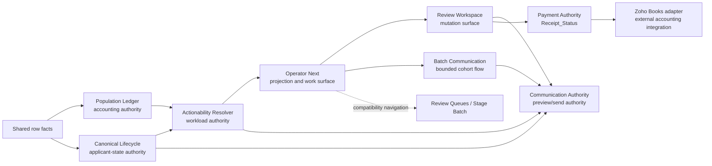

# Operator Next Architecture Blueprint

Status: parallel Track L runtime surface implemented locally; no runtime release performed

## Decision

Operator Next is a parallel operator shell over existing authorities, not a new authority layer. It combines the current Admin capability set with selected OPS ergonomics while current Admin remains the fallback during acceptance.

## Authority Flow



The UI never recomputes lifecycle, owner, workload, payment truth, or communication permission.

## Information Architecture

Primary navigation:

1. Lifecycle Map - primary operating menu and exact queue routing.
2. Operational Dashboard - attention, age, availability, activity, and health.
3. Applicant Action - actionable, cooling-off, hidden, and blocked applicant work.
4. Admissions Review - documents, review exceptions, eligibility, and handover readiness.
5. Communications - individual, selected, batch, readiness, blocks, and MTD activity.
6. Finance - payment follow-up/review, quotes, invoices, receipts, and Books handoff.
7. Portal Operations - identity, availability, progress, links, and mutation boundary.
8. Contactability - contactability workload and manual-contact boundary. Selected VCF remains disabled pending a bounded Track H adapter.
9. Registry & Classroom - eligibility, examination preparation, exceptions, and handover readiness.
10. Exceptions & Hidden - integrity, blocked, hidden, completed, and management escalation.
11. Reports & Audit - population, workload, communications, finance, registry, and reconciliation routes.
12. System Health - runtime identity, parity, integration, compatibility, and release evidence.
13. Roles & Capabilities - account, resolved role, capabilities, and unavailable reasons.

Secondary/global controls:

- Role/capability preview.
- Selected-applicant context.
- Scope, refresh, diagnostics, and audit routes.

Review Workspace remains an overlay/drawer so the operator does not lose worklist context.

## Core DTO Contract

The current Track L surface consumes existing read-only projections without adding a backend scan:

```text
admin_getActionabilityPreview()
admin_getRuntimeInfo()
admin_getOperationalDashboardMetrics()   lazy
admin_getOperationalSafetyStatus()       lazy
admin_getOpsLifecycleSummary()           explicit compatibility view only
```

Each rendered worklist row consumes these server-produced fields:

```text
applicantId
applicantName
canonicalLifecycle
actionabilityState
selectable
selectBlockReason
actionOwner
workloadGroupKey
worklistKey
worklistLabel
worklistReason
nextAction
recommendedMessageType
communicationProgress
urgency + urgencyReason
authorityState
lifecycleMismatch
```

Compatibility fields may be carried for diagnostics but must never outrank these fields.

## Component Blueprint

| Component | Responsibility | Data authority |
| --- | --- | --- |
| App shell | Navigation, selected applicant, capability projection | UI presentation only |
| Workload strip | Full population/workload reconciliation | Ledger + Actionability DTO |
| Workload group cards | Broad operational grouping | Actionability DTO |
| Worklist switcher | Immediate task partition | `worklistKey` from server |
| Current Worklist | Bounded returned cohort | Actionability rows |
| Selection bar | Select returned `selectable=true` rows only | Actionability rows |
| Review drawer | Display authority output and host mutations | Review Workspace/backend gates |
| Communication panel | Recommendation, requested template, preview/send states | Communication Authority |
| Batch modal | Reconcile selected, capped, blocked, excluded, remaining | Batch preview authority/cache |
| Finance panel | Payment truth and Books integration metadata | `Receipt_Status` + Books adapter |
| Lifecycle view | Base states and overlays | Canonical Lifecycle summary |
| Activity view | Sent/failed/skipped/cooling-off evidence | Communications Ledger |
| Diagnostics disclosure | Compatibility and mismatch evidence | Existing diagnostic DTOs |
| System Health | Runtime, parity, integration, compatibility, and release evidence | whoami + release/diagnostic tooling |
| Roles & Capabilities | Visible capability projection and unavailable reasons | `resolveAdminCapabilities_()` |

## Control Semantics

One canonical button component has five variants:

- Primary action.
- Secondary action.
- Batch action.
- Disabled action with adjacent reason.
- Busy action with `aria-busy=true` and double-submit prevention.

Role identity is not inferred from workload group. Capability output controls presentation; the backend RPC repeats the authoritative check.

## Local Runtime Structure

- `AdminUI_OperatorNext.html` owns presentation, routing, selection projection, and context-menu ergonomics.
- `AdminUI.html` mounts the parallel shell and retains the mature Review and Batch Communication modals.
- `Code.js` maps `?view=operator-next` through the authenticated Admin renderer.
- Current Admin remains `?view=admin`; retired OPS reference remains `?view=ops`.
- `.claspignore` includes the new HTML source in the deployable contract.

## Acceptance Plan

### Completed Locally: Shell and Read-only Projection

- Added Operator Next at the explicit `operator-next` route.
- Reused existing Actionability, role capability, metrics, safety, and runtime DTOs.
- Working Lifecycle cards use `canonicalLifecycle.baseState` from returned Actionability rows.
- Global Lifecycle is visibly labelled as an existing OPS compatibility summary, not canonical authority.

### Completed Locally: Review Workspace Handoff

- Open the existing Review Workspace from Operator Next.
- Preserve selected applicant and active worklist on close.
- Prove owner/stage/payment/recommendation parity.

### Completed Locally: Communication Handoffs

- Reuse existing individual and Batch Communication flows.
- Do not copy template, preview, send, cache, cooldown, or idempotency logic.
- Prove post-send actionability refresh.

### Partially Completed Locally: Finance and Contactability

- Expose Payment Follow-up versus Payment Review.
- Reuse Books preview/create adapter and current capability gates.
- Bounded selected VCF remains disabled. It requires a dedicated Track H CIS because current Actionability rows do not carry an approved phone number and the existing fallback CSV is not an exact selected-cohort export.

### Future: Staging Acceptance and Cutover

- Run side-by-side parity acceptance.
- Freeze old Admin shell to compatibility fallback.
- Cut over only after role matrix, counts, Review mutations, communications, finance, and narrow viewport acceptance pass.

## Stop Gates

- Any new lifecycle, actionability, payment, or communication derivation in UI.
- Any repeated Sheet scan introduced by shell composition.
- Any mutation bypassing Review Workspace or backend capability gates.
- Any Stage Batch semantic change bundled with shell work.
- Any direct WhatsApp send implementation.
- Any Books metadata treated as payment truth.
- Any release tooling moved into the operator shell.

## Acceptance Matrix for Runtime Integration

- Population totals match current Population Ledger.
- Workload totals match Actionability and reconcile returned/outside-window counts.
- Every selected row is server-selectable.
- Finance worklists remain disjoint and retain the same broad group.
- Review opens the correct applicant and returns without losing cohort context.
- Communication recommendation, preview, and send gate agree.
- Batch cap, cache parity, confirmation, and post-send refresh remain intact.
- Contactability never appears as Management work.
- Roles see identical UI/backend capability outcomes.
- Student and Production remain untouched during Admin staging acceptance.

## Deferred Architecture

- Google Classroom owns teaching, assessment, grading, and learning progress.
- Academic Onboarding will bridge EduOps enrolment to Classroom.
- Examination administration will move into the Registry domain.
- Refund, credit, and write-off execution belongs to Zoho Books after explicit runtime approval/handoff.
- Operational Intelligence and AI recommendations remain advisory projections.
- Engineering Mirror and recovery verification remain separate platform-completion programmes.
